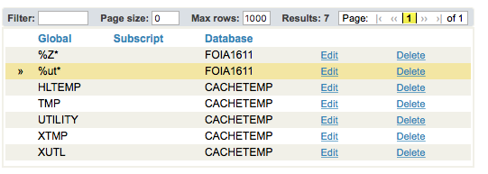

Installing Caché
=================

.. role:: usertype
    :class: usertype

The following instructions were adapted from Nancy Anthracite\'s document
entitled `InstallingVistAWithSingleUserVersionCache5.2`_, which was created
to guide a user through installing InterSystems Caché onto a Windows operating
system.  The instructions were using an older version of Caché; this uses the
Caché 2011 trial version and shows the updated Management Portal interface.

.. _`InstallingVistAWithSingleUserVersionCache5.2`:
   http://opensourcevista.net:8888/NancysVistAServer/InstallingVistAWithSingleUserVersionCache5.2.doc

Trial versions of the Caché installer can be downloaded from

    http://download.intersystems.com/download/register.csp.

This installation guide uses Caché 2011.1, it should also apply for Cache 2013.
If you already have a Caché installation and are looking to install VistA as
an additional database, you do not have to re-install Caché.
Please use your existing installation and pick up the instructions at the point
where the folder is created within the mgr folder.

Download and Install Caché
--------------------------

Download the Caché installer from the above link and double click on the
downloaded  .exe file.  The first window that requires interaction is the
Licensing Agreement shown in the figure below.
Agree to the license in order to continue in the installation process.

.. figure::
   images/InstallCache/License.png
   :align: center
   :alt:  Caché License Terms

The next window asks to set the directory in which Caché will be installed.
Most users will be able to accept the default path. If more than one instance
is found on the machine, the next instances will be denoted with a number
appended to the end of the instance name.

.. figure::
   images/InstallCache/InstallPath.png
   :align: center
   :alt:  Setting the installation path for Caché

Once the install directory is set, the installer will display a summary of the
instance that will be installed in the process.  There is the option to enter a
license if you have one, but this is not a required step for the current testing
configuration.

.. figure::
   images/InstallCache/InstallSummary.png
   :align: center
   :alt:  Summary of Caché installation options

After the installation has finished, the completion screen is shown.

.. figure::
   images/InstallCache/InstallComplete.png
   :align: center
   :alt:  Final window of Caché Installation

The first sign of a correctly installed and running instance of Caché is the
Caché Cube in the taskbar, like below.

.. figure::
   images/InstallCache/Cube.png
   :align: center
   :alt:  Screenshot of Caché Cube in taskbar.

Clicking on the Cube will open a menu that displays the options to interact
with the Caché database.

.. figure::
   images/InstallCache/MenuDoc.png
   :align: center
   :alt:  The main menu that shows when the Caché Cube is clicked.

The next test to ensure that your Caché instance is working is to open the
documentation. This will bring up the documentation home page in your default
web browser.

.. figure::
   images/InstallCache/DocMainPage.png
   :align: center
   :alt:  Documentation font page in the web browser Google Chrome.

Configuring Caché
------------------

Once Caché is installed, it is time to create the proper folders and
environment to run the VistA instance within Caché.
The first step is to go to the mgr folder of Caché and create a new folder as
shown below. This folder will hold the database file cache.dat that will
contain the VistA routines and globals.

.. figure::
   images/InstallCache/MgrFldr.png
   :align: center
   :alt:  mgr folder prior to creation of VistA folder

As an example, the folder has been given the name \"VistA.\" While the choice of
name has no bearing on the installation, the testing code requires that the
Namespace chosen below in matches the folder name created in this step.

.. figure::
   images/InstallCache/MgrFldrVistA.png
   :align: center
   :alt:  mgr folder post-creation of VistA folder

At this point we are ready to stand up the VistA instance. Right click on the
Caché cube and select Management Portal of Caché.

.. figure::
   images/InstallCache/MenuSysMgt.png
   :align: center
   :alt:  Management Portal link in Caché

This link will open a Management Portal web page. Click on System
Administration to show administrative options.

.. figure::
   images/InstallCache/SysMgtMain.png
   :align: center
   :alt:  Main page of the Management Portal

System Administration shows those options that can be used to change the Caché
system. Our goal is to use the Configuration function to create and initialize
an empty database that can then be filled with the VistA routines and globals.
Starting from |sysadmin|:

.. figure::
   images/InstallCache/SysAdminMenu.png
   :align: center
   :alt: |sysadmin|

.. |sysadmin| replace:: System Administration page of Management Portal

Click on Configuration, System Configuration, and Local Databases to arrive at
|adminmenu|. Create the database by clicking on the Local Databases tab and
then selecting Go.

.. figure::
   images/InstallCache/SysConfigMenu.png
   :align: center
   :alt: |adminmenu|

.. |adminmenu| replace:: System Configuration menu

This resulting page contains the list of all of the local databases. All of the
selections shown were created automatically during the installation of Caché.
Create a new database by clicking on the \"Create New Database\" button.
This will bring up a wizard.

.. figure::
   images/InstallCache/CreateDatabase.png
   :align: center
   :alt:  Local Databases page with pointer to Create New Database button.

Set the directory entry to the folder that you created and set the database
name. We recommend using the same name as the folder, but this is not
necessary. When satisfied, select \"Next\" to proceed.

.. figure::
   images/InstallCache/DatabaseWizardName.png
   :align: center
   :alt:  First page of the Database Wizard.

It is not necessary to change any of the default settings to enable testing
and we recommend simply hitting Finish to proceed. However, if there are known
required settings for the current site, these settings can be modified.

.. figure::
   images/InstallCache/DatabaseWizardDetails.png
   :align: center
   :alt:  Details of the Database Wizard

Verify that the newly created database appears in the database listing.

.. figure::
   images/InstallCache/ShowNewDatabase.png
   :align: center
   :alt:  Database listing with the inclusion of the recently created VistA database.

We now will configure the namespace for the newly created database. Navigate
back to the System Configuration menu, click on the Namespaces option.

.. figure::
   images/InstallCache/ConfigureNameSpace.png
   :align: center
   :alt:  Choosing Namespaces from System Configuration Menu

Then, click on the \"Create New Namespace\" button to open a wizard.

.. figure::
   images/InstallCache/CreateNewNamespace.png
   :align: center
   :alt:  Namespace listing and button to create a new namespace.

In the wizard, enter the name of the namespace and then select the database
created above. Be certain to name the Namespace the same as the folder created
above. Click on \"Save\" to finish the Namespace creation and to return to the
namespace listing.

.. figure::
   images/InstallCache/NamespaceForm.png
   :align: center
   :alt:  Choosing the name of the namespace and the database it maps to.

Verify that the new namespace is now in the list of current namespaces.

The next steps will be configuring the global and routine mappings, both of
which are accessed from this page. We will focus on the global mapping first.

.. figure::
   images/InstallCache/GlobalMappingSelect.png
   :align: center
   :alt:  Namespace listing with the new namespace in it.
          The boxes highlight the links for mapping globals and routines.

To create the new mapping, click on New Global Mapping.  This opens another
configuration wizard.

.. figure::
   images/InstallCache/NewGlobalMapping.png
   :align: center
   :alt:  Setting the Global Mapping.

For VistA, there is only one global mapping that needs to be made.
First set the Global Database location to the VistA database name, and for the
Global Name enter \"%Z*\". This will map all globals that start with \"%Z\" to
be specific to the VistA namespace. Click OK and the wizard will exit and
display the new mapping in the window.
Be sure to click on Save Changes before navigating back to the Namespaces page.

Verify that the global mapping has been saved to the namespace.

.. figure::
   images/InstallCache/SaveGlobalMapping.png
   :align: center
   :alt:  Page displaying the newly mapped globals.

The final step before Caché is ready for the import is to map the routines.
From within the Namespaces menu in the Management Portal, click on the Routine
Mappings link.

.. figure::
   images/InstallCache/RoutineMappingSelect.png
   :align: center
   :alt:  Selecting the namespace mapping link.

This page will list the current routine mappings for the VistA namespace.
Much like the globals, there are no current mappings. Click on the New Routine
Mapping button to bring up the routine mapping wizard.

.. figure::
   images/InstallCache/NewRoutineMapping.png
   :align: center
   :alt:  Adding new Routine Mappings.

Again select the database location that corresponds to the VistA database, enter
\"%DT*\" into the Routine name, and click Apply. This adds the first namespace
mapping to the VistA database.

.. figure::
   images/InstallCache/SetRoutineMapping.png
   :align: center
   :alt:  Entering the first routine mapping.

There are six other mappings that need to be entered in the same manner -

+-------+
| %RCR  |
|       |
| %XU*  |
|       |
| %ZIS* |
|       |
| %ZO*  |
|       |
| %ZT*  |
|       |
| %ZV*  |
+-------+

After the final mapping is set, click OK to be sent back to the Routine Mapping
page. You should now see the seven mappings listed on the page. Click on the
Save Changes button.

.. figure::
   images/InstallCache/SaveRoutineMapping.png
   :align: center
   :alt:  Final listing of Routine Mappings and the Save Changes button.

The final step of preparing the Caché installation for testing is to set the
instance to allow TELNET service. This is done though the System Administration
> Security > Services menu.

.. figure::
   images/InstallCache/ServicesMenu.png
   :align: center
   :alt:  Menu path to the Services option.

Click on Go to be brought to the menu which lists all services that are
supported by Caché. Near the bottom of the list you will see the
\"%Service_Telnet\" listing.

.. figure::
   images/InstallCache/TelenetServiceoff.png
   :align: center
   :alt:  The list of Services available to Caché

Click on the link to bring up the \"Edit Service\" page.

.. figure::
     
   :align: center
   :alt:  Edit Service page for %Service_Telnet.

To enable the Telnet session, simply check the box next to \"Service Enabled\"
and then click \"Save\".

.. figure::
   images/InstallCache/EnableTelnetService.png
   :align: center
   :alt:  Enabling the Telenet service.

After saving, the Services menu will now show that the Telnet service is enabled.

.. figure::
   images/InstallCache/TelnetServiceEnabled.png
   :align: center
   :alt:  Services menu with Telnet enabled

Install CACHE.DAT
-----------------

These instructions for installing CACHE.DAT are copied from the `OSEHRA VistA 
repository on GitHub
<https://github.com/OSEHRA/VistA/blob/master/Documentation/InstallCacheDat.rst>`_.

**--- These instructions are for Windows environments only ---**

If you have a CACHE.DAT file that was downloaded from an external source (The
VA or OSEHRA) or from a backup, then you can use that file rather than
`importing from the VistA-M repository`_.

.. _`importing from the VistA-M repository`: ImportCache.rst

The first step in installing the CACHE.DAT  is to stop the Caché instance
so that the instance will not clobber a process during the copy.

Right click on the Caché Cube in the taskbar

.. figure:: images/InstallCache/Cube.png
   :align: center
   :alt:  Screenshot of Caché Cube in taskbar.

and select \"Stop Caché\". This will pop up a window for confirmation.

.. figure:: images/InstallCache/ShutdownOptions.png
   :align: center
   :alt:  Screenshot of pop up window to stop a Caché instance.

Select "Shut down" and click \"OK\".  A status window will appear while the
shutdown is happening.  It will disappear and the taskbar Caché Cube will turn
gray when the instance is down.

.. figure:: images/InstallCache/ShutdownStatus.png
   :align: center
   :alt:  Screenshot of shutdown status window

Caché Cube has turned gray as the instance has been shut down.

.. figure:: images/InstallCache/CubeDown.png
   :align: center
   :alt:  Screenshot of grayed-out Caché Cube in taskbar.

At this point, you can take your downloaded CACHE.DAT and copy it into the
directory that has been set up in Caché for VistA.  If you followed the
InstallCache.rst_ script, it will be \"C:/Intersystems/TryCache/mgr/VistA\".

All that is left is to restart the Caché instance.  Right-click on the
grayed-out Caché Cube and click \"Start Caché\".  A status window will pop up
to signifiy the instance is starting up.

.. figure:: images/InstallCache/StartupStatus.png
   :align: center
   :alt:  Screenshot of start up status window.

When it disappears and the Caché Cube is blue, the instance is ready for use
again.
