Set-up HL7 Messages from and to VistA
=====================================
Authors: Sam Habiel. Thanks to David Whitten for help with VistA; to Loyd
Bittle for teaching me how to use Mirth.

License: |license|

.. |license| image:: https://i.creativecommons.org/l/by/4.0/80x15.png 
   :target: http://creativecommons.org/licenses/by/4.0/ 

Last updated in December 2018.

  Before proceeding with this section, you should have completed
  `Initializing VistA<./InitializeVistA.html>`_.

Purpose of this Tutorial
------------------------
This tutorial will help you set-up both outgoing and incoming connections to
HL7 in VistA via
`TCP<https://en.wikipedia.org/wiki/Transmission_Control_Protocol>`_ only. The
tutorial will be very thin on theoretical content on HL7 itself. For a fuller
treatment of the subject matter, consult the manuals in the `VistA
Documentation Library<https://www.va.gov/vdl/application.asp?appid=8>`_, in
particular, `this
manual<https://www.va.gov/vdl/documents/Infrastructure/Health_Level_7_(HL7)/hl71_6p56_p66.pdf>`_.
There is a newer HL7 messaging system in VistA called "HL7 Optimized (HLO)" --
we wont be discussing that here as HLO is not widely used.

What is HL7?
------------
HL7 means Health Level 7, the number 7 corresponding to the Application Layer
in the `OSI Model<https://en.wikipedia.org/wiki/OSI_model>`_. In brief, it is
a messaging format used in Medicine. It's important because when deploying
VistA in a healthcare setting, you almost always have to talk to other machines,
such a lab instruments, ECG/EKG instruments, X-ray machines, and the list goes
on forever. The way to talk to all of these instruments is using HL7.

When we speak of HL7 in this document, we specifically mean HL7 versions 2.1,
2.2, 2.3, and 2.4, which are all similar to each other. We will not talk about
HL7 v.3 and later, which include CDA documents and the like as these are not
used for interfacing with Medical Devices.

What is an HL7 message?
-----------------------
The following description is taken from `this manual<https://www.va.gov/vdl/documents/Infrastructure/Health_Level_7_(HL7)/hl71_6p56_p66.pdf>`_.

An HL7 message is the atomic unit for transferring data between systems in the
HL7 standard.  Each message has a header segment composed of a number of
fields, including a field containing the message type and (HL7 versions 2.2 and
above) event type. These are each three-character codes, defined by the HL7
standard. The type of a transaction is defined by the message type/event type
pair (again for HL7 versions 2.2 and above). Rules for constructing message
headers and messages are provided in the "Control/Query" chapter of the HL7
standard.  

An HL7 message consists of one or more HL7 segments . A segment is similar to a
record in a file. Each segment consists of one or more fields separated by a
special character called the field separator . The field separator character is
defined in the Message Header (MSH) segment of an HL7 message. The MSH segment
is always the first segment in every HL7 message (except for batch HL7
messages, which begin with BHS or FHS segments).  

In addition to the field separator character, four other special characters,
called encoding characters, are used as delimiters. Encoding characters are
also defined in the MSH segment.  Each encoding character must be unique, and
serves a specific purpose. None of the encoding characters can be the same as
the field separator character. The four delimiters for which there are
encoding characters are: 

* Component separator. Some data fields can be divided into multiple
  components. The component separator character separates adjacent components
  within a data field.
* Repetition separator. Some data fields can be repeated multiple times in a
  segment. The repetition separator character separates multiple occurrences of
  a field.
* Escape character. Data fields defined as text or formatted text can include
  escape sequences. The escape character separates escape sequences from the
  actual text.
* Sub-component separator. Some data fields can be divided into components, and
  each component can be further divided into sub-components. The sub-component
  separator character separates adjacent sub-components within a component of a
  field.

Here's an example of an HL7 message:

::

  MSH|^~\&|INFOLIO TEST|BOSTON VAMC|IB TEST|500|19900314130405|ORU^R01|523123|D|2.3|
  PID||7777790^2^M10||HL7Patient^One||||||||123456789|
  OBR||2930423.08^1^L||199304230800|||||||DERMATOLOGY|
  OBX|CE|10040|OV|1^0^0^0^0|
  OBX|CE|11041|PR|
  OBX|CE|216.6|P|
  OBX|ST|VW^WEIGHT^L||120|KG
  OBX|ST|VB^BLOOD PRESSURE^L||120/80|MM HG
  OBX|ST|VT^TEMPERATURE^L||99|C
  OBX|ST|VP^PULSE^L||75|/MIN 

* The first line of the message is the message header (MSH) segment 
  * The field separator is ‘|’, the component separator is ‘^’, the repetition
    separator is ‘~’, the escape character is ‘\’ and the subcomponent
    separator is ‘&’. This is the recommended set.
  * The sending application is INFOLIO TEST and the receiving application is
    IBTEST.
  * The sending facility is BOSTON VAMC and the receiving facility is 500. 
  * The message type is Observation Result/Unsolicited (ORU) and the event type
    is an unsolicited transmission of an observation message (R01). 
* The message type (from the MSH segment) is Observation Result/Unsolicited
  (ORU) 
* The second line of the message is the second segment, Patient Identification
  (PID)  
* The third line of the message is the third segment, an Observation Request
  (OBR) 
* The subsequent lines of the message are multiple observation/results (OBX)
  segments 

Most HL7 messages are unsolicited. They are sent to VistA; or VistA sends them;
without either party knowing beforehand that they are getting a message.

HL7 messages typically require an acknowledgement message to be sent. A sample
acknowledgement looks like this:

::

  MSH|^~\&|CATH|StJohn|AcmeHIS|StJohn|20061019172719||ACK^O01|MSGID12349876|P|2.3
  MSA|AA|MSGID12349876

The second piece of the MSA segment is either:

* AA – Application Accept
* AE – Application Error
* AR – Application Reject
* CA - Commit Accept
* CE - Commit Error
* CR - Commit Reject

There is one more thing that's important to mention: The messages above are
just the contents. The actual message transmitted over TCP contains several
control characters to delimit the start and the end of the message. (TCP is a
stream protocol; so you must provide either message lengths or delimiters to
delineate the beginning and end of a message). This is called the HL7 Minimal
Lower Layer Protocol (MLLP). So a full HL7 message over TCP looks like this:

::
  
  I VERTICAL TAB - $C(11)/0X0B>
  HL7 MESSAGE
  <ASCII FILE SEPARATOR - $C(28)/0X1C>
  <ASCII CARRIAGE RETURN - $C(13)/0X0D>

HL7 System Startup
------------------
There are some persistent Taskman tasks that need to be created in order for
the HL7 system to initialize itself. The tasks are ``HL AUTOSTART LINK
MANAGER`` and ``HL TASK RESTART``, which need to be set to start-up persistent.
On a production system, you must schedule ``HL PURGE TRANSMISSIONS`` nightly to
ensure that you don't run out of disk space.

To schedule these tasks, go to `this section<./InitializeVistA.html#back-to-taskman>`_
of the Initialize VistA document. Remember, two of the tasks are to be marked
as Startup Persistent, and one is recurring every night.

Here's a screen capture in Fileman 

.. raw:: html

  <pre>FOIA201805&gt;D P^DI

  MSC FileMan 22.1060

  Select OPTION: <strong>ENTER</strong> OR EDIT FILE ENTRIES

  Input to what File: OPTION SCHEDULING// <strong>&lt;enter&gt;</strong>  (18 entries)
  EDIT WHICH FIELD: ALL//<strong>&lt;enter&gt;</strong>  

  Select OPTION SCHEDULING NAME: <strong>HL AUTOSTART LINK </strong>MANA  GER       Autostart Link Manager
    Are you adding 'HL AUTOSTART LINK MANAGER' as
      a new OPTION SCHEDULING (the 16TH)? No// <strong>Y</strong>  (Yes)
  QUEUED TO RUN AT WHAT TIME:<strong>&lt;enter&gt;</strong>
  DEVICE FOR QUEUED JOB OUTPUT:<strong>&lt;enter&gt;</strong>
  OTHER DEVICE PARAMETERS:<strong>&lt;enter&gt;</strong>
  QUEUED TO RUN ON VOLUME SET:<strong>&lt;enter&gt;</strong>
  RESCHEDULING FREQUENCY:<strong>&lt;enter&gt;</strong>
  SPECIAL QUEUEING: <strong>SP</strong>  Startup Persistent
  Select VARIABLE NAME:<strong>&lt;enter&gt;</strong>
  USER TO RUN TASK: <strong>^</strong>

  Select OPTION SCHEDULING NAME: <strong>HL TASK RESTART</strong>       Restart/Start All Links and Filers
    Are you adding 'HL TASK RESTART' as
      a new OPTION SCHEDULING (the 17TH)? No// <strong>Y</strong>  (Yes)
  QUEUED TO RUN AT WHAT TIME: <strong>^SPECIAL QUEUEING</strong>
  SPECIAL QUEUEING: <strong>SP</strong>  Startup Persistent
  Select VARIABLE NAME: <strong>^</strong>

  Select OPTION SCHEDULING NAME: <strong>HL,PUR</strong>
       1   HL PURGE JOB REVIEW       Purge jobs monitoring
       2   HL PURGE QUEUE (TCP)       Purge Outgoing Queue (TCP Only)
       3   HL PURGE TRANSMISSIONS       Purge Messages
  CHOOSE 1-3: <strong>3</strong>  HL PURGE TRANSMISSIONS     Purge Messages
    Are you adding 'HL PURGE TRANSMISSIONS' as
      a new OPTION SCHEDULING (the 18TH)? No// <strong>Y</strong>  (Yes)
  QUEUED TO RUN AT WHAT TIME: <strong>T+1@0100</strong>  (DEC 28, 2018@01:00)
  DEVICE FOR QUEUED JOB OUTPUT:
  OTHER DEVICE PARAMETERS:
  QUEUED TO RUN ON VOLUME SET:
  RESCHEDULING FREQUENCY: <strong>1D</strong>
  SPECIAL QUEUEING: <strong>^</strong></pre>

If Taskman is running, it should "catch" the new persistent tasks and start
them. If you run the system status from direct mode, you should see a bunch
of HL7 tasks now running (italicized).

.. raw:: html

  <pre>FOIA201805&gt;<strong>X ^%ZOSF("SS")</strong>

  GT.M System Status users on 27-DEC-18 21:30:16
  <strong>PID   PName   Device       Routine            Name                CPU Time</strong>
  1136  mumps   BG-0         STARTOUT+17^HLCSOUTPOSTMASTER          18:44:51
  1816  mumps   BG-0         GETTASK+3^%ZTMS1   Sub 1816            21:00:32
  <i>4776  mumps   BG-0         LOOP+2^HLCSMM1     POSTMASTER          18:44:51</i>
  <i>5960  mumps   BG-0         LOOP+2^HLCSMM1     POSTMASTER          18:44:52</i>
  6512  mumps   BG-0         GETTASK+3^%ZTMS1   Sub 6512            18:44:51
  8756  mumps   BG-0         GO+12^XMTDT        POSTMASTER          18:44:52
  <i>8800  mumps   BG-0         LOOP+7^HLCSLM      POSTMASTER          18:44:50</i>
  <i>9456  mumps   BG-0         LOOP+2^HLCSMM1     POSTMASTER          18:44:51</i>
  9580  mumps   BG-0         GETTASK+3^%ZTMS1   Sub 9580            18:44:52
  10020 mumps   BG-0         GETTASK+3^%ZTMS1   Sub 10020           20:44:58
  <i>10132 mumps   BG-0         STARTIN+28^HLCSIN  POSTMASTER          18:44:51</i>
  10220 mumps   BG-0         IDLE+3^%ZTM        Taskman ROU 1       18:44:49
  10764 mumps   BG-0         GO+26^XMKPLQ       POSTMASTER          18:44:52
  12096 mumps   BG-0         GETTASK+3^%ZTMS1   Sub 12096           18:45:08
  12388 mumps   BG-0         GETTASK+3^%ZTMS1   Sub 12388           21:00:33
  12476 mumps   /dev/pty0    INTRPTALL+8^ZSY    사용자,하나         17:56:44
  12616 mumps   BG-0         GETTASK+3^%ZTMS1                       20:00:31
  12876 mumps   BG-0         GETTASK+3^%ZTMS1   Sub 12876           20:44:56
  12968 mumps   BG-S9000     LGTM+25^%ZISTCPS   POSTMASTER          18:44:50
  13308 mumps   BG-0         GETTASK+3^%ZTMS1                       18:44:51</pre>

HL7 Send Setup
--------------
What I will show here is a typical scenario of sending messages out to other
systems. VistA sends messages at specific events (the messages sent and the
event at which a message is sent is typically documented in the technical
manual for a package on the `VDL<https://www.va.gov/vdl>`_). The event is
something that happens inside of VistA, such as the registration of a patient,
the availability of lab results, or the scheduling of an appointment. The
example we will use is patient registration, upon which VistA can send an HL7
ADT/A04 message, which is a patient registration message.

Introduction to Outgoing Message Routing in VistA
^^^^^^^^^^^^^^^^^^^^^^^^^^^^^^^^^^^^^^^^^^^^^^^^^
This part is confusing, mainly because the way an outgoing message is processed
is almost identical to how an incoming message is processed. So we will discuss
this again in the context of incoming messages.

To send an outgoing message from VistA, you need to create an EVENT DRIVER
protocol (it actually lives in a file called PROTOCOL in Fileman). The EVENT
DRIVER is also known as a SERVER (which I personally find confusing, but oh
well). Here's the one we will use: (NB: to reach this form, you need to
navigate to EVE > HL7 Main Menu > Interface Developer Options > Protocol Edit
and select ``VAFC ADT-A04 SERVER``.)

::
  
  |                        HL7 INTERFACE SETUP                         PAGE 1 OF 2
  --------------------------------------------------------------------------------
  
              NAME: VAFC ADT-A04 SERVER
  
  DESCRIPTION (wp): + [This server protocol fires when a patient is re]
  
  
  ENTRY ACTION:
  
   EXIT ACTION:
  
  
          TYPE: event driver
  
  
  
  _______________________________________________________________________________
  
  Exit    Save    Refresh    Quit

On the second page of the form (to reach it, cursor down to "TYPE" field and
press enter), you will see the list of subscribers (we have two in this case:
``VBECS ADT-A04 CLIENT`` and ``HMP ADT-A04 CLIENT``).

::
  
  |                           HL7 EVENT DRIVER                         PAGE 2 OF 2
                           VAFC ADT-A04 SERVER
  --------------------------------------------------------------------------------
        SENDING APPLICATION: VAFC PIMS
   TRANSACTION MESSAGE TYPE: ADT                        EVENT TYPE: A04
          MESSAGE STRUCTURE:
              PROCESSING ID: P                          VERSION ID: 2.3
            ACCEPT ACK CODE: NE               APPLICATION ACK TYPE: NE
  
   RESPONSE PROCESSING RTN:
                             SUBSCRIBERS
    VBECS ADT-A04 CLIENT
    HMP ADT-A04 CLIENT
  
  
  
  
  _______________________________________________________________________________
  
  Exit    Save    Previous Page    Refresh    Quit

So basically, when VistA calls ``VAFC ADT-A04 SERVER``, VistA will send the
message to the subscribers ``VBECS ADT-A04 CLIENT`` and ``HMP ADT-A04 CLIENT``.
For the curious, the registration HL7 message is generated in routine ``VAFCA04``
using this line of code: ``D GENERATE^HLMA("VAFC ADT-A04 SERVER","LM",1,.HLRST,"",.HL)``.

There are a couple more details we need to talk about. If you move your cursor
to one of the subscribers, and press enter, you will see a bunch of fields,
three of which are important.

::

  |                           HL7 EVENT DRIVER                         PAGE 2 OF 2
     ┌──────────────────────────HL7 SUBSCRIBER────────────────────────────────┐
  ---│                       VBECS ADT-A04 CLIENT                             │---
     │------------------------------------------------------------------------│
   TR│     RECEIVING APPLICATION: VBECS ADT                                   │
     │                                                                        │
     │     RESPONSE MESSAGE TYPE: ACK                         EVENT TYPE: A04 │
     │                                                                        │
     │SENDING FACILITY REQUIRED?:           RECEIVING FACILITY REQUIRED?:     │
   RE│                                                                        │
     │        SECURITY REQUIRED?:                                             │
    V│                                                                        │
    H│              LOGICAL LINK: VBECSPTU                                    │
     │                                                                        │
     │ PROCESSING RTN:                                                        │
     │  ROUTING LOGIC:                                                        │
     └────────────────────────────────────────────────────────────────────────┘
  _______________________________________________________________________________

The important fields we need to look at are ``LOGICAL LINK``, ``PROCESSING RTN``,
and ``ROUTING LOGIC``. The way they are used is confusing. They actually
override each other, in this order:

1. If the programmer creates an ``HLL("LINKS")`` array, that overrides
   everything, and none of the following steps take place. HLL("LINKS")
   basically tells VistA to ignore all the subscribers and use the subscribers
   in the HLL("LINKS") array. That means that steps 2-4 are evaluated for
   the subscribers in the HLL("LINKS") array.
2. If ``ROUTING LOGIC`` is specified, that is executed; and nothing else is.
3. If ``LOGICAL LINK`` is specified, the message is delivered to the IP address/
   domain name on the logical link and then we stop.
4. If neither ``LOGICAL LINK`` nor ``ROUTING LOGIC`` is specified, then the
   message is assumed to be an internal VistA to itself message, and the code
   for ``PROCESSING RTN`` is used. If ``PROCESSING RTN`` is not filled out,
   that's an error condition.

For most users, using a ``LOGICAL LINK`` to send a message out to an external
system is the correct thing to do.

Here are the steps for setting up to send a message from VistA to the outside:

* Create Logical Link
* Enable Logical Link
* Create Subscriber Client & Receiving Application
* (Application Specific) Enable Sending HL7 messages
* Test

In this example, what I will do is receive the message using the
`netcat<http://netcat.sourceforge.net/>`_ program, which is a generic socket
listener; and then we will download
`Mirth<https://www.nextgen.com/products-and-services/NextGen-Connect-Integration-Engine-Downloads>`_
and use it to receive a message. Mirth is an HL7 (and other formats) integration
engine -- and it's a realistic target to receive HL7 messages.

Outgoing Message Setup
^^^^^^^^^^^^^^^^^^^^^^
Create Logical Link
"""""""""""""""""""
In real life, you will have a destination machine with an IP/domain name and
port number you need to communicate to. For the purposes of this demonstration,
I will initially set-up a ``netcat`` listener on my local machine on port 6661.
That means that my new logical link will call 127.0.0.1 port 6661. I will call
my link MEMPHIS. Logical links are not typically namespaced. To create a new
logical link, go to EVE > HL7 Main Menu > Interface Developer Options > Link
Edit [EL]

.. raw:: html

  <pre>Select HL LOGICAL LINK NODE: <strong>MEMPHIS</strong>
    Are you adding 'MEMPHIS' as a new HL LOGICAL LINK (the 77TH)? No// <strong>Y</strong>
                            HL7 LOGICAL LINK
  --------------------------------------------------------------------------------

                  NODE: MEMPHIS                        DESCRIPTION:

           INSTITUTION:

        MAILMAN DOMAIN:

             AUTOSTART:

            QUEUE SIZE: 10

              LLP TYPE:

            DNS DOMAIN:
  _______________________________________________________________________________

  Exit    Save    Refresh    Quit</pre>

On the Screenman form, scroll to "LLP TYPE" and type "TCP". Fill in the fields
as shown in bold below:

.. raw:: html

  <pre>                      HL7 LOGICAL LINK
  --------------------------------------------------------------------------------
    ┌──────────────────────TCP LOWER LEVEL PARAMETERS─────────────────────────┐
    │                      MEMPHIS                                            │
    │                                                                         │
    │  TCP/IP SERVICE TYPE: <strong>CLIENT (SENDER)</strong>                                   │
    │       TCP/IP ADDRESS: <strong>127.0.0.1</strong>                                         │
    │          TCP/IP PORT: <strong>6661</strong>                                              │
    │          TCP/IP PORT (OPTIMIZED):                                       │
    │                                                                         │
    │   ACK TIMEOUT: <strong>1</strong>                     RE-TRANSMISION ATTEMPTS:           │
    │  READ TIMEOUT: <strong>1</strong>                   EXCEED RE-TRANSMIT ACTION:           │
    │    BLOCK SIZE:                                      SAY HELO:           │
    │                                      TCP/IP OPENFAIL TIMEOUT:           │
    │STARTUP NODE:                                      PERSISTENT:           │
    │   RETENTION:                            UNI-DIRECTIONAL WAIT:           │
    └─────────────────────────────────────────────────────────────────────────┘
  _______________________________________________________________________________

  Close    Refresh</pre>

Type C for Close when you are at the command window; and then type S to Save,
then E to exit. You will be given the message: "If you shut down this link to
edit, please remember to restart if appropriate." That's what we are going to
do next.

Enable Logical Link
"""""""""""""""""""
To enable the link we just created, we go to HL7 Main Menu > 
Filer and Link Management Options > Start/Stop Links [SL].

.. raw:: html

  <pre>Select Filer and Link Management Options Option: <strong>SL</strong>  Start/Stop Links

  This option is used to launch the lower level protocol for the
  appropriate device.  Please select the node with which you want
  to communicate

  Select HL LOGICAL LINK NODE: <strong>MEMPHIS</strong>
  This LLP has been enabled!</pre>

Create Subscriber Client & Receiving Application
""""""""""""""""""""""""""""""""""""""""""""""""
The easiest way to add a client to the EVENT DRIVER ``VAFC ADT-A04 SERVER`` is
to edit the event driver and add a subscriber to the multiple on the second
page. Go to HL7 Main Menu > Interface Developer Options > Protocol Edit [EP],
and then select ``VAFC ADT-A04 SERVER``.

::
  
  |                        HL7 INTERFACE SETUP                         PAGE 1 OF 2
  --------------------------------------------------------------------------------
  
              NAME: VAFC ADT-A04 SERVER
  
  DESCRIPTION (wp): + [This server protocol fires when a patient is re]
  
  
  ENTRY ACTION:
  
   EXIT ACTION:
  
  
          TYPE: event driver
  
  
  
  _______________________________________________________________________________
  
  Exit    Save    Refresh    Quit

Cursor down to "TYPE" field and press enter to reach the second page of the
form. 

::
  
  |                           HL7 EVENT DRIVER                         PAGE 2 OF 2
                           VAFC ADT-A04 SERVER
  --------------------------------------------------------------------------------
        SENDING APPLICATION: VAFC PIMS
   TRANSACTION MESSAGE TYPE: ADT                        EVENT TYPE: A04
          MESSAGE STRUCTURE:
              PROCESSING ID: P                          VERSION ID: 2.3
            ACCEPT ACK CODE: NE               APPLICATION ACK TYPE: NE
  
   RESPONSE PROCESSING RTN:
                             SUBSCRIBERS
    VBECS ADT-A04 CLIENT
    HMP ADT-A04 CLIENT
  
  
  
  
  _______________________________________________________________________________
  
  Exit    Save    Previous Page    Refresh    Quit

On the second page of the form, move your cursor down to the end of the
list of the subscribers (there are normally 3 in FOIA, so you should be at the
4th position, which should be empty). Start typing a namespaced name of your
client (a namespace is a place where you put your code; if you don't have one
use ZZ) -- which will be "ZZ ADT-A04 CLIENT". You will be asked:

* Are you adding "ZZ ADT-A04 CLIENT" as a new PROTOCOL? Answer Yes.
* PROTOCOL ITEM TEXT: Enter "ADT A04 TEST CLIENT"
* PROTOCOL IDENTIFIER: Leave blank

Once you do that, you will see this:

::

  |                         HL7 EVENT DRIVER                         PAGE 2 OF 2
     ┌──────────────────────────HL7 SUBSCRIBER────────────────────────────────┐
  ---│                       ZZ ADT-A04 CLIENT                                │---
     │------------------------------------------------------------------------│
   TR│     RECEIVING APPLICATION:                                             │
     │                                                                        │
     │     RESPONSE MESSAGE TYPE:                             EVENT TYPE:     │
     │                                                                        │
     │SENDING FACILITY REQUIRED?:           RECEIVING FACILITY REQUIRED?:     │
   RE│                                                                        │
     │        SECURITY REQUIRED?:                                             │
    V│                                                                        │
    H│              LOGICAL LINK:                                             │
    Z│                                                                        │
     │ PROCESSING RTN:                                                        │
     │  ROUTING LOGIC:                                                        │
     └────────────────────────────────────────────────────────────────────────┘
  _______________________________________________________________________________

  c        CLOSE
  r        REFRESH

Fill in the RECEIVING APPLICATION, RESPONSE MESSAGE TYPE, EVENT TYPE, and 
LOGICAL LINK.

* RECEIVING APPLICATION: Create a new one called NETCAT. Make sure it's marked
  as ACTIVE.
* RESPONSE MESSAGE TYPE: ACK
* EVENT TYPE: A04
* LOGICAL LINK: MEMPHIS (or whatever you called it).

This is what you will see for the new RECEIVING APPLICATION:

::

  --┌────────────────────Receiving Application Edit───────────────────────────┐---
    │                                                                         │
   T│         NAME: NETCAT                          ACTIVE/INACTIVE: ACTIVE   │
    │                                                                         │
    │FACILITY NAME:                                    COUNTRY CODE:          │
    │                                                                         │
    │   MAIL GROUP:                                                           │
   R└─────────────────────────────────────────────────────────────────────────┘

This is the final display.

::

  |                         HL7 EVENT DRIVER                         PAGE 2 OF 2
     ┌──────────────────────────HL7 SUBSCRIBER────────────────────────────────┐
  ---│                       ZZ ADT-A04 CLIENT                                │---
     │------------------------------------------------------------------------│
   TR│     RECEIVING APPLICATION: NETCAT                                      │
     │                                                                        │
     │     RESPONSE MESSAGE TYPE: ACK                         EVENT TYPE: A04 │
     │                                                                        │
     │SENDING FACILITY REQUIRED?:           RECEIVING FACILITY REQUIRED?:     │
   RE│                                                                        │
     │        SECURITY REQUIRED?:                                             │
    V│                                                                        │
    H│              LOGICAL LINK: MEMPHIS                                     │
    Z│                                                                        │
     │ PROCESSING RTN:                                                        │
     │  ROUTING LOGIC:                                                        │
     └────────────────────────────────────────────────────────────────────────┘
  _______________________________________________________________________________

Go to the command area, type "C" for close, and then "E" for exit.

At this point, we should be theoretically ready to send an HL7 message to the
MEMPHIS channel.

Check the Link Manager
""""""""""""""""""""""
Now, we should check that the Link Manager to make sure there are no messages
on the MEMPHIS Logical Link. Check it by going to HL7 Main Menu > Systems Link 
Monitor. This is what you will see, and it is what we expect.

::

  |                SYSTEM LINK MONITOR for PLATINUM (P System)                  
                MESSAGES  MESSAGES   MESSAGES  MESSAGES  DEVICE
     NODE       RECEIVED  PROCESSED  TO SEND   SENT      TYPE     STATE

    LISTENER    236       235        903       903        MS     2 server
    MCAR OUT                         10                          Shutdown
    ROR SEND    1         1          5         1          NC     Shutdown
    XUMF ACK    1738      1738       1035      1035       NC     Enabled
    XUMF FORUM                       3         3                 Enabled
    XUMF TEST                        4         4                 Enabled

     Incoming filers running => 1            TaskMan running
     Outgoing filers running => 1            Link Manager running
                                             Monitor current [next job 1.0 hr]
     Select a Command:
  (N)EXT  (B)ACKUP  (A)LL LINKS  (S)CREENED  (V)IEWS  (Q)UIT  (?) HELP:

Quit (Q) out of this, and exit the menu system and go back to the direct mode
in VistA. We need to run a simple test with a patient we registered `earlier
<./InitializeVistA.html#registering-your-first-patient>`_.

Creating a Test Message
"""""""""""""""""""""""
  
  NB: There is a recently introduced bug in HLCSTCP3 (patched up to 157 on the
  second line), line 69, which says:

  ``Q:(HLOS'["VMS")&(HLOS'["UNIX")  X "U IO:(::""-M"")"``

  This line is incorrect in many regards: it assumes all Cache systems run on
  VMS or UNIX; and it assumes that all UNIX systems will be Cache. Neither of 
  these assumptions are correct.

  It's safe to comment this line out. A more proper fix which takes into account
  other M systems can be found `here<https://raw.githubusercontent.com/shabiel/foia-vista-fixes/master/Routines/HLCSTCP3.m>`_.
  You need to comment the line out or get the new copy of the routine before
  proceeding any further.

::

  $ mumps -dir

  FOIA201805>S DUZ=1

  FOIA201805>D ^XUP

  Setting up programmer environment
  This is a TEST account.

  Terminal Type set to: C-VT220

  Select OPTION NAME:

  FOIA201805>N % S %=$$EN^VAFCA04(1,$$NOW^XLFDT)

If you crash, read this note:

  If you crash with this error: OBX+10^RGADTP, Undefined local variable:
  HL(SFN), it means that you did not change the station number that came with
  FOIA (050) and some downstream code is expecting 3 digit station numbers.
  This error comes from the subscriber ``RG ADT-A04 TRIGGER``, which you may
  have seen when editing the subscribers for EVENT DRIVER ``VAFC ADT-A04
  SERVER``. Without having to do the station numbers as described in
  `Initailize VistA<./InitializeVistA.html#setup-your-institution>`_, you can
  just go to the subscribers again, move the cursor to ``RG ADT-A04 TRIGGER``,
  and then type "@" to remove it.

If we go back to the System Link Monitor (DO ^XUP, type EVE, choose 1, then
navigate to HL7 Main Menu > Systems Link Monitor), we will see that MEMPHIS now
shows up as open. It will switch between Open and Openfail as we haven't opened
a server socket yet.

::

  |                SYSTEM LINK MONITOR for PLATINUM (P System)                  
                MESSAGES  MESSAGES   MESSAGES  MESSAGES  DEVICE
     NODE       RECEIVED  PROCESSED  TO SEND   SENT      TYPE     STATE

    LISTENER    236       235        903       903        MS     2 server
    MCAR OUT                         10                          Shutdown
    MEMPHIS                          1                    NC     Open
    ROR SEND    1         1          5         1          NC     Shutdown
    VBECSPTU    0         0          1         0          NC     Shutdown
    XUMF ACK    1738      1738       1035      1035       NC     Enabled
    XUMF FORUM                       3         3                 Enabled
    XUMF TEST                        4         4                 Enabled

     Incoming filers running => 1            TaskMan running
     Outgoing filers running => 1            Link Manager running
                                             Monitor current [next job 0.8 hr]
     Select a Command:
  (N)EXT  (B)ACKUP  (A)LL LINKS  (S)CREENED  (V)IEWS  (Q)UIT  (?) HELP:

Setup Netcat for Message Receipt
^^^^^^^^^^^^^^^^^^^^^^^^^^^^^^^^
In another window, type the following

::

  nc -l 6661 >> hl7_msg.txt
 
Go back to the Link Monitor. You will see that MEMPHIS switches from being Open
to Retention to Inactive; and the column for MESSAGES SENT becomes 1.

Back to the netcat window, type CTRL-C to stop the listener, and then dump the
file using the cat command on Linux or type command on Windows. What you will
see would be similar to this:

::

  $ cat -v hl7_msg.txt
  ^KMSH^~|\&^VAFC PIMS^50^NETCAT^^20181228121041-0400^^ADT~A04^505356^P^2.3^^^NE^NE^USA^MEVN^A04^20181228121041-0400^^^1~M-lM-^BM-,M-lM-^ZM-)M-lM-^^M-^P~M-mM-^UM-^XM-kM-^BM-^X^MPID^1^500000001V075322^1~8~M10^1155P^M-kM-'M-^HM-lM-^ZM-0M-lM-^JM-$~M-kM-/M-8M-mM-^BM-$^""^19551111^M^^""~~0005~""~~CDC^ M-fM-^]M-1M-dM-:M-,M-dM-8M--M-eM-$M-.M-iM-^CM-5M-dM->M-?M-eM-1M-^@~ M-fM-^]M-1M-dM-:M-,M-iM-^CM-=M-dM-8M--M-eM-$M-.M-eM-^LM-:M-eM-^EM-+M-iM-^GM-^MM-fM-4M-2M-dM-8M-^@M-dM-8M-^AM-gM-^[M-.5M-gM-^UM-*3M-eM-^OM-7 ~M-fM-^]M-1M-dM-:M-,M-dM-8M--M-eM-$M-.M-iM-^CM-5M-dM->M-?M-eM-1M-^@~M-fM-^]M-1~100-8994~JAPAN~P~""~""|""~""~""~""~""~~VACAE~""~""~~~""&""|""~""~""~""~""~~VACAA~""~""~~~""&""|""~""~""~""~""~~VACAC~""~""~~~""&""|""~""~""~""~""~~VACAM~""~""~~~""&""|""~""~""~""~""~~VACAO~""~""~~~""&""^^""^""^^""^29^^505111155P^^^""~~0189~""~~CDC^ ^MPD1^^^PLATINUM~~050^""^MPV1^1^O^""^^^^^^^^^^^^^^^NON-VETERAN (OTHER)^^^^^^^^^^^^^^^^^^^^^^^^^^^^^^^^104^MOBX^1^MZPD^1^""^""^""^""^""^""^""^""^""^0^""^""^""^""^0^""^0^""^""^""^MZSP^1^0^""^""^""^""^""^""^^""^""^MZEL^1^""^""^""^""^""^""^0^NON-VETERAN (OTHER)^""^""^""^""^""^""^""^""^""^""^""^""^""^^^^MZCT^1^1^""^""^""^""^""^""^""^MZEM^1^1^""^""^""^""^""^""^^MZFF^2^^MZIR^^MZEN^1^M^\^M

Setup Mirth for Message Receipt
^^^^^^^^^^^^^^^^^^^^^^^^^^^^^^^
Now we are going to set-up Mirth to receive a message.
`Mirth<http://www.mirthcorp.com/>`_ is what is known as an integration engine.
An integration engine is essentially a store/transform/and forward software
for messages between different systems. Mirth is open source software and is
frequently used with VistA in production implementations. It can be downloaded
from `here<https://www.nextgen.com/products-and-services/NextGen-Connect-Integration-Engine-Downloads>`_.

Install Mirth
"""""""""""""
I won't cover how to install Mirth. You are on your own for that. It's not as
simple as it used to be due to changes on how Java applications can be launched.
The main install should also install the program "Mirth Connect Administrator Launcher",
which is what you need to launch in order to launch Mirth Connect.

Once you turn on the "Administrator Launcher", this is what you should see:

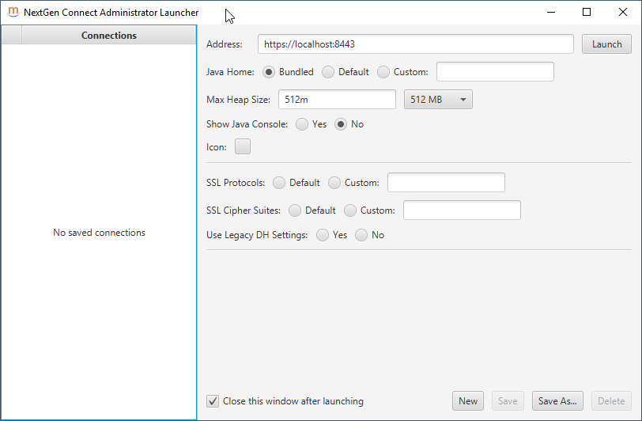

   Mirth Connect Administrator Launcher

After that, you see the login for Mirth Connect:

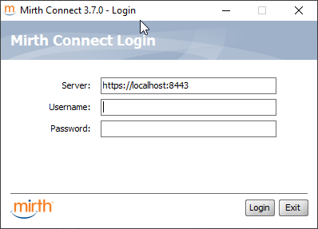

   Mirth Connect Login

   

Login with the default username/password (unless you have changed them) of
admin/admin. Mirth Connect Administrator will be launched, and you will be
greeted with a welcome screen. Fill that in appropriately and click Finish.

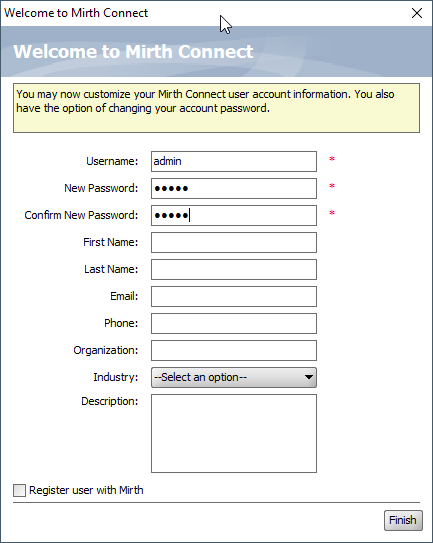
   
   Mirth Connect Welcome

At last, you will get the main screen for Mirth Connect Administrator:

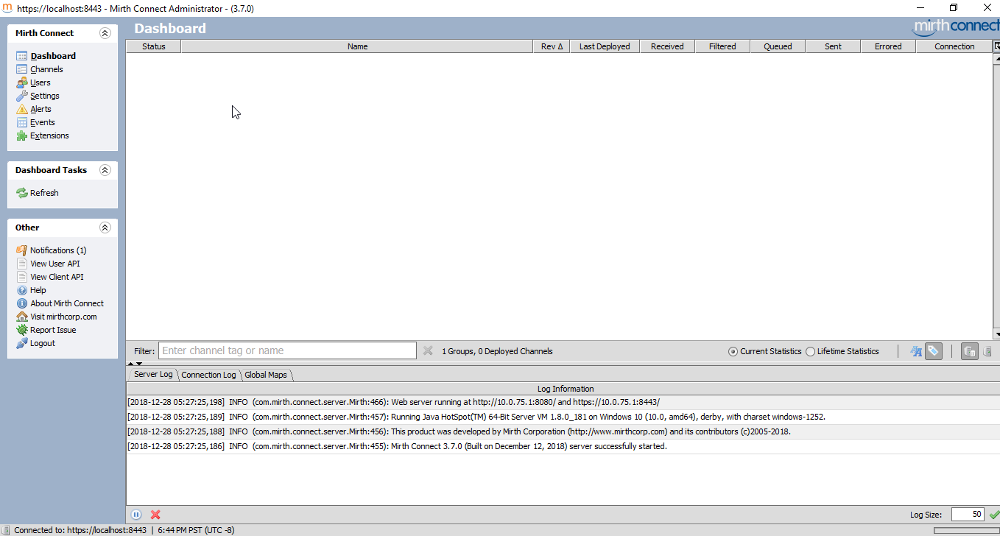

   Mirth Administrator Main Screen

Note that all the "hot buttons" are on the left hand side. To edit Channels,
we need to click on "Channels".

Set-up a Channel
""""""""""""""""
Click on "Channels". The left hand side will get a new drop down called
"Channel Tasks". Click on "New Channel". This is what you will see:

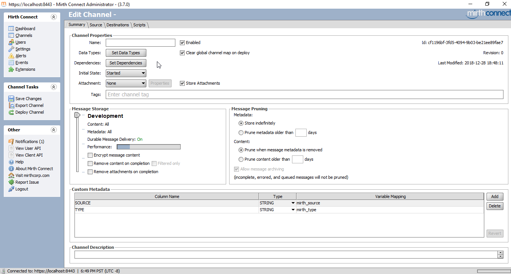

   Mirth New Channel Summary

We are currently on the summary tab. All we have to do here is put a name, like
"VistA HL7 Receiver". The data type on the channel is by default HL7 2.x, so we
don't need to modify that. Now click on the "Source Tab". You will initially
see this:

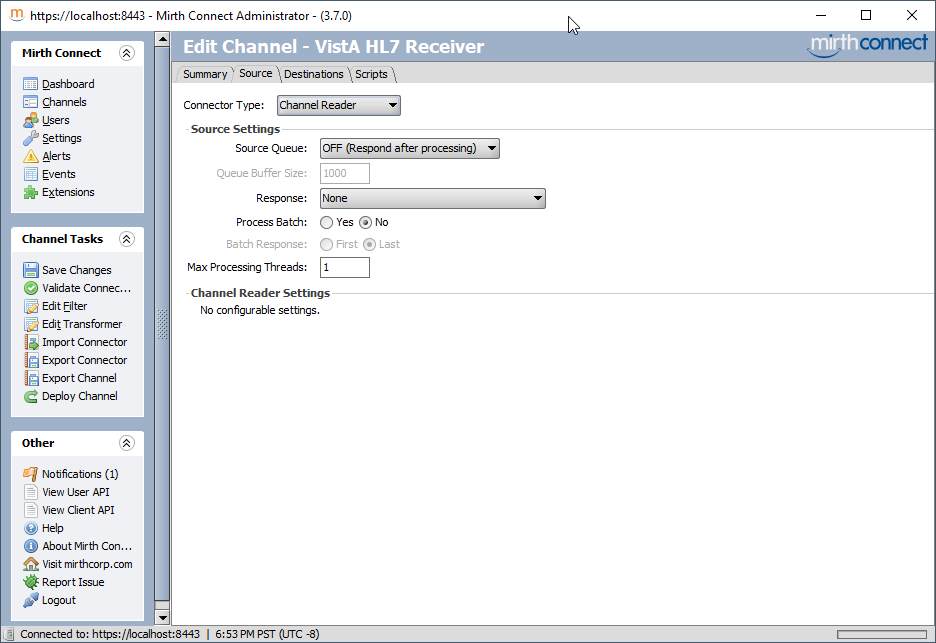

   Mirth New Channel Source Summary

Change the connector type (first drop down) to "TCP Listener", and review the
setting you see here. 

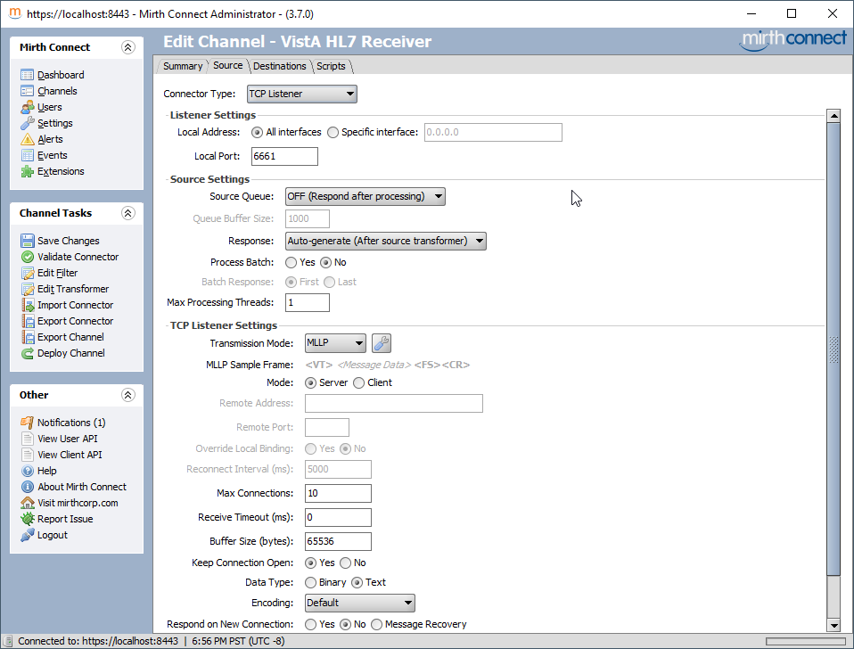

   Mirth New Channel Source Source

The only thing you may want to change is the Local Port, in order for it to
match VistA. I already chose 6661 for VistA, so we should be good to go. If you
are running VistA in UTF-8 mode, or another mode, you need to double check the
encoding matches the data you will be sending from VistA.

On the right hand side, click on Channel Tasks > Save Changes. Then click on
Channel Tasks > Deploy Channel, and confirm that you really want to deploy it.

Now you will see the Dashboard with the enabled channel:

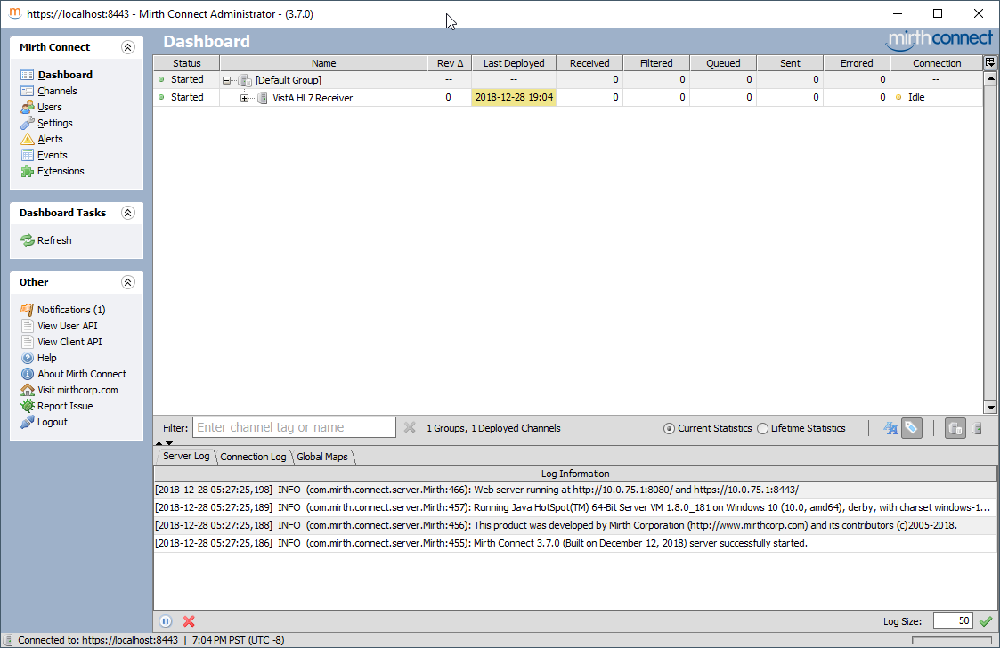

   Mirth Dashboard after Deploy

Send Test HL7 Message to Mirth
""""""""""""""""""""""""""""""
Run the test again that we ran before::

  $ mumps -dir

  FOIA201805>S DUZ=1

  FOIA201805>D ^XUP

  Setting up programmer environment
  This is a TEST account.

  Terminal Type set to: C-VT220

  Select OPTION NAME:

  FOIA201805>N % S %=$$EN^VAFCA04(1,$$NOW^XLFDT)

View message in Mirth
"""""""""""""""""""""
In a few moments, the Mirth Dashboard will now show that you have a new message:

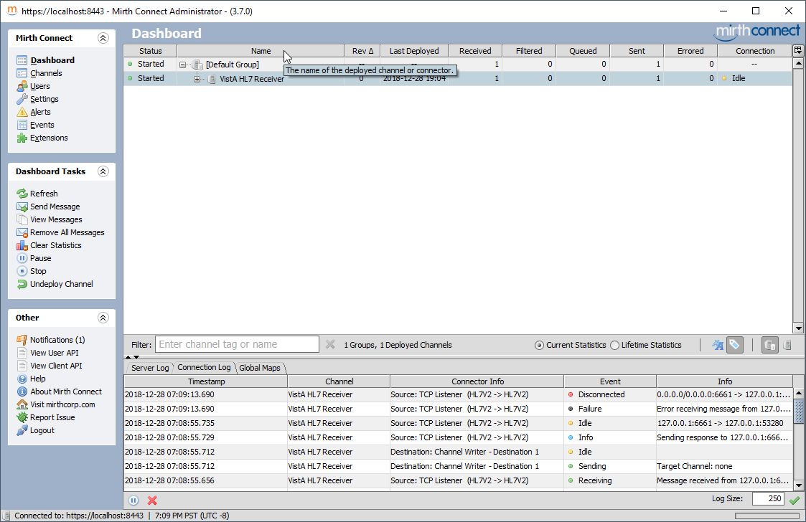

   Mirth Dashboard after Test Message

To view the message, double click on the VistA HL7 Receiver row, and you will
be taken to the Channel Messages view

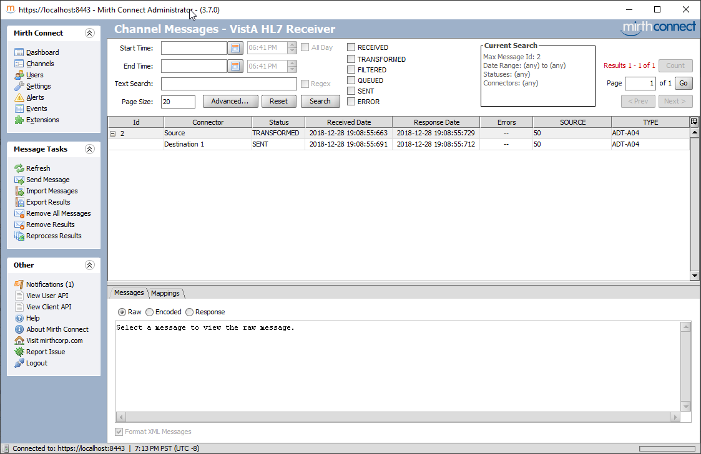

   Mirth Channel Messages

Click on the top row (the one saying "TRANSFORMED). Once you do that, you will
see the full contents of the message that VistA sent.

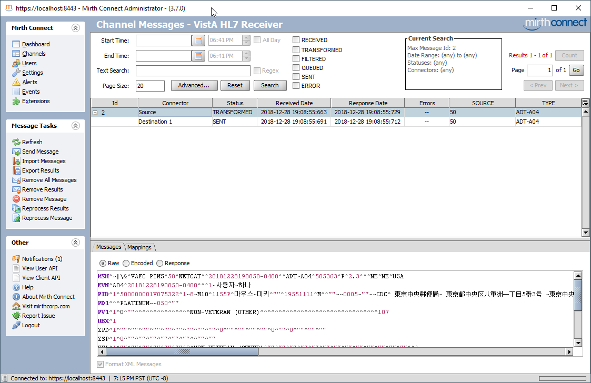

   Mirth Channel Single Message

Turn on HL7 messages in MAS Parameters
^^^^^^^^^^^^^^^^^^^^^^^^^^^^^^^^^^^^^^
Once we have confirmed that the system to send HL7 messages for patient
registrations seems to work, let's turn it on. You need to change field
``SEND PIMS HL7 V2.3 MESSAGES`` in file ``MAS PARAMETERS`` to ``SEND``. I
think it comes set that way by default in FOIA VistA.

.. raw:: html

  <pre>FOIA201805&gt;<strong>D P^DI</strong>

  MSC FileMan 22.1060

  Select OPTION: <strong>ENTER</strong> OR EDIT FILE ENTRIES

  Input to what File: PROTOCOL// <strong>MAS PARAMETERS</strong>    (0 entries)
  EDIT WHICH FIELD: ALL// <strong>SEND</strong>
       1   SEND PIMS HL7 V2.2 MESSAGES
       2   SEND PIMS HL7 V2.3 MESSAGES
  CHOOSE 1-2: <strong>2</strong>  SEND PIMS HL7 V2.3 MESSAGES
  THEN EDIT FIELD: <strong>&lt;enter&gt;</strong>

  Select MAS PARAMETERS ONE: <strong>`1</strong>
  SEND PIMS HL7 V2.3 MESSAGES: SEND// <strong>?</strong>
       Choose from:
         1        SEND
         0        STOP
         2        SUSPEND
  SEND PIMS HL7 V2.3 MESSAGES: SEND// <strong>1</strong>  SEND

  Select MAS PARAMETERS ONE:<strong>&lt;enter&gt;</strong></pre>

Register a Patient
^^^^^^^^^^^^^^^^^^
Now it's time to register a patient, and see the HL7 come across. This time
log-in into the front door using ^ZU. On GT.M/YottaDB, that's ``$gtm_dist/mumps -r ZU``;
on Cache, that's ``csession <instance> -U <namespace> ZU``. Use the access and
verify codes you set-up in `Initialize VistA<./InitializeVistA.html>`_.

I should note that if you do not finish all the registration steps, an A04
message won't get generated. Instead, an A08 message (patient update) is
generated if you exit early. That doesn't make any good sense to me, but that's
the way the code is written.

Note the ``^Register a Patient``. A ^ in front of a menu means search all the
menu system for that option and run it.

.. raw:: html

  <pre>Volume set: ROU:memphis  UCI: VAH  Device: /dev/pty0

  ACCESS CODE: <strong>******</strong>
  VERIFY CODE: <strong>********</strong>

  Good afternoon 사용자,하나
       You last signed on today at 16:27

  Checking POSTMASTER mailbox.
  POSTMASTER has 681 new messages. (681 in the 'IN' basket)

            Core Applications ...
            Device Management ...
            Menu Management ...
            Programmer Options ...
            Operations Management ...
            Spool Management ...
            Information Security Officer Menu ...
            Taskman Management ...
            User Management ...
            Application Utilities ...
            Capacity Planning ...
            HL7 Main Menu ...

  <TEST ACCOUNT> Select Systems Manager Menu Option: <strong>^Register a Patient</strong>

  CPT (CPT is a registered trademark of the American Medical Association) codes,
  descriptions and other data are copyright 1966, 1970, 1973, 1977, 1981,
  1983-2017 American Medical Association.

  CPT is commercial technical data developed exclusively at private expense by
  Contractor/Manufacturer American Medical Association, AMA Plaza, 330 N. Wabash
  Ave., Suite 39300, Chicago, IL 60611-5885.  The provisions of this Agreement
  between AMA and VA prevail, including prohibiting creating derivative works and
  providing CPT to any third parties outside of the Facilities.

  Press any key to continue <strong>&lt;enter&gt;</strong>

  Select PATIENT NAME: <strong>HLSEVEN,TEST</strong>
     ARE YOU ADDING 'HLSEVEN,TEST' AS A NEW PATIENT (THE 20TH)? No// <strong>Y</strong>  (Yes)
     PATIENT SEX: <strong>M</strong> MALE
     PATIENT DATE OF BIRTH: <strong>11/11/20</strong>  (NOV 11, 1920)
     PATIENT SOCIAL SECURITY NUMBER: <strong>P</strong>  703111120P
     PATIENT PSEUDO SSN REASON: <strong>N</strong> NO SSN ASSIGNED
     PATIENT TYPE: <strong>NON-VETERAN</strong> (OTHER)
     PATIENT VETERAN (Y/N)?: <strong>N</strong> NO
     PATIENT SERVICE CONNECTED?: <strong>N</strong> NO
     PATIENT MULTIPLE BIRTH INDICATOR:<strong>&lt;enter&gt;</strong>

     ...searching for potential duplicates

     No potential duplicates have been identified.

     ...adding new patient...new patient added

  Patient name components--
  FAMILY (LAST) NAME: HLSEVEN//<strong>&lt;enter&gt;</strong>
  GIVEN (FIRST) NAME: TEST//<strong>&lt;enter&gt;</strong>
  MIDDLE NAME:<strong>&lt;enter&gt;</strong>
  PREFIX:<strong>&lt;enter&gt;</strong>
  SUFFIX:<strong>&lt;enter&gt;</strong>
  DEGREE:<strong>&lt;enter&gt;</strong>
  Press ENTER to continue<strong>&lt;enter&gt;</strong>

  Please verify or update the following information:

  MOTHER'S MAIDEN NAME:<strong>&lt;enter&gt;</strong>
  PLACE OF BIRTH [CITY]:<strong>&lt;enter&gt;</strong>
  PLACE OF BIRTH [STATE]:<strong>&lt;enter&gt;</strong>
  Select ALIAS:<strong>&lt;enter&gt;</strong>

  Attempting to connect to the Master Patient Index in Austin...
  If no SSN or inexact DOB or common name, this request
  may take some time, please be patient...

  Could not connect to MPI or Timed Out, assigning local ICN (if not already assig
  ned)...

  Insurance data retrieval has been initiated.

  HLSEVEN,TEST;    703-11-1120P                                    NOV 11,1920
  =============================================================================
   Permanent Mailing Address:             Temporary Mailing Address:
           STREET ADDRESS UNKNOWN                 NO TEMPORARY MAILING
           UNK. CITY/STATE

    County: UNSPECIFIED                     From/To: NOT APPLICABLE
     Phone: UNSPECIFIED                       Phone: NOT APPLICABLE
    Office: UNSPECIFIED
      Cell: UNSPECIFIED
    E-mail: UNSPECIFIED
  Bad Addr:

   Confidential Address:                      Confidential Address Categories:
           NO CONFIDENTIAL ADDRESS
   From/To: NOT APPLICABLE

      POS: UNSPECIFIED                      Claim #: UNSPECIFIED
    Relig: UNSPECIFIED                          Birth Sex: MALE
     Race: UNANSWERED                     Ethnicity: UNANSWERED
  Type &lt;Enter&gt; to continue or '^' to exit:<strong>&lt;enter&gt;</strong>

  HLSEVEN,TEST;    703-11-1120P                                    NOV 11,1920
  =============================================================================

  Language Date/Time: UNANSWERED
   Preferred Language: UNANSWERED

    Combat Vet Status: NOT ELIGIBLE
  Primary Eligibility: UNSPECIFIED
  Other Eligibilities:
        Unemployable: NO
        Permanent & Total Disabled: NO

  Status      : PATIENT HAS NO INPATIENT OR LODGER ACTIVITY IN THE COMPUTER
  Type &lt;Enter&gt; to continue or '^' to exit:<strong>&lt;enter&gt;</strong>

  HLSEVEN,TEST;    703-11-1120P                                    NOV 11,1920
  =============================================================================

  Future Appointments: NONE

  Remarks:

  Date of Death Information
       Date of Death:
       Source of Notification:
       Updated Date/Time:
       Last Edited By:

  Health Benefit Plans Currently Assigned to Veteran:
     None
  Do you want to enter Patient Data? Yes// <strong>&lt;enter&gt;</strong>  (Yes)
                  PATIENT DEMOGRAPHIC DATA, SCREEN &gt;1&lt;
  HLSEVEN,TEST;    703-11-1120P                               NON-VETERAN (OTHER)
  ===============================================================================

  [1]    Name: HLSEVEN,TEST                   SS: 703-11-1120P
          DOB: NOV 11,1920           PSSN Reason: No SSN Assigned
       Family: HLSEVEN                 Birth Sex: MALE    MBI: UNANSWERED
        Given: TEST                    [2] Alias: &lt; No alias entries on file &gt;
       Middle:
       Prefix:
       Suffix:
       Degree:
       Self-Identified Gender Identity: UNANSWERED
  [3] Remarks: NO REMARKS ENTERED FOR THIS PATIENT
  [4] Permanent Mailing Address:                  [5] Temporary Mailing Address:
           STREET ADDRESS UNKNOWN                 NO TEMPORARY ADDRESS
           UNK. CITY/STATE

     County: UNANSWERED                      County: NOT APPLICABLE
      Phone: UNANSWERED                       Phone: NOT APPLICABLE
     Office: UNANSWERED                     From/To: NOT APPLICABLE
   Bad Addr:
  &lt;RET&gt; to CONTINUE, 1-5 or ALL to EDIT, ^N for screen N or '^' to QUIT:<strong>&lt;enter&gt;</strong>
            ADDITIONAL PATIENT DEMOGRAPHIC DATA, SCREEN &lt;1.1&gt;
  HLSEVEN,TEST;    703-11-1120P                               NON-VETERAN (OTHER)
  ===============================================================================
  [1]Confidential Address
       NO CONFIDENTIAL ADDRESS

                                            From/To:  NOT APPLICABLE
  [2]    Cell Phone: UNANSWERED
            Pager #: UNANSWERED
      Email Address: UNANSWERED

  [3] Language Date/Time: UNANSWERED
       Preferred Language: UNANSWERED

  &lt;RET&gt; to CONTINUE, 1-3 or ALL to EDIT, ^N for screen N or '^' to QUIT:<strong>&lt;enter&gt;</strong>
                        PATIENT DATA, SCREEN &lt;2&gt;
  HLSEVEN,TEST;    703-11-1120P                               NON-VETERAN (OTHER)
  ===============================================================================
  [1]  Marital: UNANSWERED                    POB: UNANSWERED
      Religion: UNANSWERED                 Father: UNANSWERED
           SCI: UNANSWERED                 Mother: UNANSWERED
                                     Mom's Maiden: UNANSWERED

  [2] Previous Care Date      Location of Previous Care
      ------------------      -------------------------
      NONE INDICATED          NONE INDICATED

  [3] Ethnicity: UNANSWERED
           Race: UNANSWERED

  &lt;4&gt; Date of Death Information
       Date of Death:                      Source of Notification:
       Updated Date/Time:                  Last Edited By:

  [5] Emergency Response:

  &lt;RET&gt; to CONTINUE, 1,2,3,5 or ALL to EDIT, ^N for screen N or '^' to QUIT:<strong>&lt;enter&gt;</strong>
                   EMERGENCY CONTACT DATA, SCREEN &lt;3&gt;
  HLSEVEN,TEST;    703-11-1120P                               NON-VETERAN (OTHER)
  ===============================================================================
  [1]      NOK: UNANSWERED                  [2] NOK-2: UNANSWERED
      Relation: UNANSWERED                   Relation: UNANSWERED
         Phone: UNANSWERED                      Phone: UNANSWERED
    Work Phone: UNANSWERED                 Work Phone: UNANSWERED
  [3]  E-Cont.: UNANSWERED               [4] E2-Cont.: UNANSWERED
      Relation: UNANSWERED                   Relation: UNANSWERED
         Phone: UNANSWERED                      Phone: UNANSWERED
    Work Phone: UNANSWERED                 Work Phone: UNANSWERED
  [5] Designee: UNANSWERED                          Relation: UNANSWERED
         Phone: UNANSWERED                 Work Phone: UNANSWERED

  &lt;RET&gt; to CONTINUE, 1-5 or ALL to EDIT, ^N for screen N or '^' to QUIT:<strong>&lt;enter&gt;</strong>
              APPLICANT/SPOUSE EMPLOYMENT DATA, SCREEN &lt;4&gt;
  HLSEVEN,TEST;    703-11-1120P                               NON-VETERAN (OTHER)
  ===============================================================================
  [1] Employer: UNANSWERED                &lt;2&gt; Spouse's: NOT APPLICABLE

    Occupation: UNANSWERED
        Status: UNANSWERED
   Retired Dt.: NOT APPLICABLE

  &lt;RET&gt; to CONTINUE, 1 or ALL to EDIT, ^N for screen N or '^' to QUIT:<strong>&lt;enter&gt;</strong>
                       INSURANCE DATA, SCREEN &lt;5&gt;
  HLSEVEN,TEST;    703-11-1120P                               NON-VETERAN (OTHER)
  ===============================================================================
  [1] Covered by Health Insurance: NOT ANSWERED

     Insurance   COB Subscriber ID     Group       Holder  Effective  Expires
     ===========================================================================
      No Insurance Information

  [2] Eligible for MEDICAID: UNANSWERED

  [3] Medicaid Number:

  &lt;RET&gt; to CONTINUE, 1-3 or ALL to EDIT, ^N for screen N or '^' to QUIT:<strong>&lt;enter&gt;</strong>
                   ELIGIBILITY STATUS DATA, SCREEN &lt;7&gt;
  HLSEVEN,TEST;    703-11-1120P                               NON-VETERAN (OTHER)
  ===============================================================================
  [1]       Patient Type: NON-VETERAN (OTHER)               Veteran: NO
           Svc Connected: N/A                            SC Percent: N/A
           Rated Incomp.: UNANSWERED
            Claim Number: UNANSWERED
             Folder Loc.: UNANSWERED
  [2]   Aid & Attendance: UNANSWERED                     Housebound: UNANSWERED
              VA Pension: UNANSWERED
           VA Disability: UNANSWERED
      Total Check Amount: NOT APPLICABLE
            GI Insurance: UNANSWERED                         Amount: UNANSWERED
  [3]  Primary Elig Code: UNANSWERED
      Other Elig Code(s): NO ADDITIONAL ELIGIBILITIES IDENTIFIED
       Period of Service: UNANSWERED

  &lt;4&gt; Service Connected Conditions as stated by applicant
      ---------------------------------------------------
      NONE STATED

  &lt;RET&gt; to CONTINUE, 1-3 or ALL to EDIT, ^N for screen N or '^' to QUIT:<strong>&lt;enter&gt;</strong>
               ELIGIBILITY VERIFICATION DATA, SCREEN &lt;11&gt;
  HLSEVEN,TEST;    703-11-1120P                               NON-VETERAN (OTHER)
  ===============================================================================
  [1] Eligibility Status: NOT VERIFIED                Status Date: NOT APPLICABLE
       Status Entered By: NOT APPLICABLE
        Interim Response: UNANSWERED (NOT REQUIRED)
           Verif. Method: NOT APPLICABLE
           Verif. Source: NOT AVAILABLE
  [2]     Money Verified: NOT VERIFIED
  [3]   Service Verified: NOT VERIFIED
  [4] Rated Disabilities: NOT APPLICABLE - NOT A VETERAN

  [5] Health Benefit Plan:  (None Specified)

  &lt;RET&gt; to CONTINUE, 1-5 or ALL to EDIT, ^N for screen N or '^' to QUIT:<strong>&lt;enter&gt;</strong>
                   ADMISSION INFORMATION, SCREEN &lt;12&gt;
  HLSEVEN,TEST;    703-11-1120P                               NON-VETERAN (OTHER)
  ===============================================================================

  NO ADMISSION DATA ON FILE FOR THIS PATIENT!!

  &lt;RET&gt; to CONTINUE, ^N for screen N or '^' to QUIT:<strong>&lt;enter&gt;</strong>
                  APPLICATION INFORMATION, SCREEN &lt;13&gt;
  HLSEVEN,TEST;    703-11-1120P                               NON-VETERAN (OTHER)
  ===============================================================================

  NO APPLICATION DATA ON FILE FOR THIS PATIENT!

  &lt;RET&gt; to CONTINUE, ^N for screen N or '^' to QUIT:<strong>&lt;enter&gt;</strong>
                  APPOINTMENT INFORMATION, SCREEN &lt;14&gt;
  HLSEVEN,TEST;    703-11-1120P                               NON-VETERAN (OTHER)
  ===============================================================================
  &lt;1&gt; Enrollment Clinics: NOT ACTIVELY ENROLLED IN ANY CLINICS AT THIS TIME

  &lt;2&gt;     Pending Appt's: NO PENDING APPOINTMENTS ON FILE

  &lt;RET&gt; to CONTINUE, ^N for screen N or '^' to QUIT:<strong>&lt;enter&gt;</strong>
              SPONSOR DEMOGRAPHIC INFORMATION, SCREEN &lt;15&gt;
  HLSEVEN,TEST;    703-11-1120P                               NON-VETERAN (OTHER)
  ===============================================================================
  [1] Sponsor Information:

  No Sponsor Information available.

                              *** Team Information ***

                     -- No team assignment information found --

  &lt;RET&gt; to QUIT, 1 or ALL to EDIT, ^N for screen N or '^' to QUIT:<strong>&lt;enter&gt;</strong>

  CONSISTENCY CHECKER TURNED OFF!!
  Patient is exempt from Copay.

  Is the patient currently being followed in a clinic for the same condition? <strong>N</strong>
    (No)

  Is the patient to be examined in the medical center today? Yes//  <strong>&lt;enter&gt;</strong> (Yes)

  Registration login date/time: NOW//  <strong>&lt;enter&gt;</strong> (DEC 28,2018@16:40)
  TYPE OF BENEFIT APPLIED FOR: <strong>1</strong>  HOSPITAL
  TYPE OF CARE APPLIED FOR: <strong>1</strong>  DENTAL
  REGISTRATION ELIGIBILITY CODE: <strong>HUMANITARIAN</strong> EMERGENCY
           //                        6      6   NON-VETERAN

  Updating eligibility status for this registration...

    NEED RELATED TO AN ACCIDENT: <strong>N</strong>  NO
    NEED RELATED TO OCCUPATION: <strong>N</strong>  NO
  PRINT 10-10EZ? YES// <strong>NO</strong>
  PRINT HEALTH SUMMARY? Yes// <strong>N</strong>  (No)
  ROUTING SLIP? Yes// <strong>N</strong>  (No)
  PRINT ENCOUNTER FORMS? Yes// <strong>N</strong>  (No)

  Select PATIENT NAME:</pre>

At the point you see ``Select PATIENT NAME``, it means that your A04 HL7 message
just got sent. If you check the Link Manager, you will see an extra message
that just got sent; and if you check Mirth or netcat, you will see that you just
received an extra message.

HL7 Receive Setup
-----------------
Introduction
^^^^^^^^^^^^
What we will do this tutorial is set-up the VistA listener for HL7 first; and
then we will send a message to VistA to register a patient and make VistA
process it.

Find or Configure a Multilistner Port
^^^^^^^^^^^^^^^^^^^^^^^^^^^^^^^^^^^^^
There are three ways to set-up the listener in VistA:

* Single Listener
* Native Multi Listener (available on Cache/Windows ONLY)
* Multi Listener via xinetd

The recommended way to configure VistA is to use the Multi Listener via xinetd.
Since that's hard to set-up (I have been consulted in more that one instance on
setting this up on production systems), I will also show how to set-up the
single-listener in VistA, which should be good for experimentation. 

Xinetd Set-up
"""""""""""""
First, you need to find out if there is an existing multi-threaded listener on
FOIA. It turns out that there is one. You can find it its internal entry number
in the LOGICAL LINK file by looking in the "E","M" index of the file::

  FOIA201805>WRITE $ORDER(^HLCS(870,"E","M",0))
  4

If we inquire into entry #4 in file 870 in Fileman, this is the information that
we get:

.. raw:: html

  <pre>FOIA201805&gt;S DUZ=1

  FOIA201805&gt;D Q^DI

  MSC FileMan 22.1060

  Select OPTION: <strong>INQUIRE</strong> TO FILE ENTRIES

  Output from what File: KERNEL SYSTEM PARAMETERS// <strong>870</strong>  HL LOGICAL LINK
                                            (77 entries)
  Select HL LOGICAL LINK NODE: <strong>`4</strong>  LISTENER
  Another one:
  Standard Captioned Output? Yes//  <strong>&lt;enter&gt;</strong> (Yes)
  Include COMPUTED fields:  (N/Y/R/B): NO//  <strong>&lt;enter&gt;</strong>- No record number (IEN), no Computed Fields

  NODE: LISTENER                          LLP TYPE: TCP
    DEVICE TYPE: Multi-threaded Server    STATE: 2 server
    AUTOSTART: Enabled                    MAILMAN DOMAIN: FOIA.DOMAIN.EXT
    TIME STOPPED: APR 12,2018@13:59:35    SHUTDOWN LLP ?: YES
    QUEUE SIZE: 10                        RE-TRANSMISSION ATTEMPTS: 5
    READ TIMEOUT: 600                     ACK TIMEOUT: 600
    EXCEED RE-TRANSMIT ACTION: shutdown   TCP/IP ADDRESS: 127.0.0.1
    TCP/IP PORT: 5030                     TCP/IP SERVICE TYPE: MULTI LISTENER
    IN QUEUE BACK POINTER: 236            IN QUEUE FRONT POINTER: 235
    OUT QUEUE BACK POINTER: 903           OUT QUEUE FRONT POINTER: 903</pre>

The piece of data we are interested in is the "TCP/IP PORT" number. In this
case, it's 5030. So, in the following xinetd configurations, you should
substitute the port number with 5030.

On Cache, here's the xinetd definition::

  service scd_hlst
  {
      type = UNLISTED
      disable = no
      flags = REUSE
      socket_type = stream
      protocol = tcp
      port = {port number}
      bind = xx.xx.xx.xx
      wait = no
      user = {cache user that you need to set-up for OS Authentication on Cache}
      env = port={port number}
      server = /usr/local/cachesys/devfey/bin/csession
      server_args = {instance} -ci -U {namespace} PORT^HLCSTCPA
      instances = UNLIMITED
      per_source = UNLIMITED
  }

On GT.M/YottaDB, you need a combination of an xinetd script and a shell script.
It looks as follows::

  service foia201805-hl7
  {
      port = {port}
      socket_type = stream
      protocol = tcp
      type = UNLISTED
      user = Hp
      server = {shell path to script}
      wait = no
      disable = no
      per_source = UNLIMITED
      instances = UNLIMITED
  }

The shell script looks as follows::

  #!/bin/sh
  . /var/db/foia201805/env.vista

  LOG=$vista_home/log/hl7.log

  echo "$$ Job begin `date`"                                      >>  ${LOG}
  echo "$$  ${gtm_dist}/mumps -run GTMLNX^HLCSGTM"                >>  ${LOG}

  ${gtm_dist}/mumps -run GTMLNX^HLCSGTM                          2>>  ${LOG}
  echo "$$  HL7 Listner stopped with exit code $?"                >>  ${LOG}
  echo "$$ Job ended `date`"

To test that the connection works, use netcat or a similar tool to to connect to
the port. Make sure the connection stays open. If it opens and then closes, then
you have an problem. You should check the error trap with ``D ^XTER`` if that
happens.::

  $ nc -v localhost 5030
  Connection to localhost 5030 port [tcp/*] succeeded!

Single listener Setup
""""""""""""""""""""""""""
Go to EVE > HL7 Main Menu > Filer and Link Management Options > Link Edit.
Create an entry called SLISTENER on the first page, and mark the LLP type as
TCP::

  |                         HL7 LOGICAL LINK
  --------------------------------------------------------------------------------

                  NODE: SLISTENER                      DESCRIPTION:

           INSTITUTION:

        MAILMAN DOMAIN:

             AUTOSTART:

            QUEUE SIZE: 10

              LLP TYPE: TCP

            DNS DOMAIN:
  _______________________________________________________________________________

  Exit    Save    Refresh    Quit

Once you hit enter after typing TCP, you will see the second page. Set the 
TCP/IP SERVICE TYPE to SINGLE LISTENER, and the port to a reasonable number
(but not 5000, 5001, 5030, 5031, as these are reserved for the multi-listeners
on production/test for HL7/HLO.

::

  |                         HL7 LOGICAL LINK
  --------------------------------------------------------------------------------
    ┌──────────────────────TCP LOWER LEVEL PARAMETERS─────────────────────────┐
    │                      SLISTENER                                          │
    │                                                                         │
    │  TCP/IP SERVICE TYPE: SINGLE LISTENER                                   │
    │       TCP/IP ADDRESS:                                                   │
    │          TCP/IP PORT: 5032                                              │
    │          TCP/IP PORT (OPTIMIZED):                                       │
    │                                                                         │
    │   ACK TIMEOUT:                       RE-TRANSMISION ATTEMPTS:           │
    │  READ TIMEOUT:                     EXCEED RE-TRANSMIT ACTION:           │
    │    BLOCK SIZE:                                      SAY HELO:           │
    │                                      TCP/IP OPENFAIL TIMEOUT:           │
    │STARTUP NODE:                                      PERSISTENT:           │
    │   RETENTION:                            UNI-DIRECTIONAL WAIT:           │
    └─────────────────────────────────────────────────────────────────────────┘
  _______________________________________________________________________________

  Close    Refresh

  Enter a COMMAND, or "^" followed by the CAPTION of a FIELD to jump to.

  COMMAND: Close                                    Press <F1>H for help  Insert

Once you do that, start the listener using Start/Stop Links [SL] on the same
menu::

  Select Filer and Link Management Options Option: SL  Start/Stop Links

  This option is used to launch the lower level protocol for the
  appropriate device.  Please select the node with which you want
  to communicate

  Select HL LOGICAL LINK NODE:    SLISTENER
  Job was queued as 8139.

To test that the connection works, use netcat or a similar tool to to connect to
the port. Make sure the connection stays open. If it opens and then closes, then
you have an problem. You should check the error trap with ``D ^XTER`` if that
happens (netcat gives a weird output below with native listeners, that's okay)::

  $ nc -v localhost 5032
  nc: connect to localhost port 5032 (tcp) failed: Connection refused
  Connection to localhost 5032 port [tcp/*] succeeded!

VistA Message Receive Set-up
^^^^^^^^^^^^^^^^^^^^^^^^^^^^
Now that we have a working listener, we have to find an example on how to use
it. In many of the cases, you will be hooking up to existing HL7 clients in
VistA.  I couldn't find an easy standalone example, so I came up with a small
example in which we can send a ADT/A04 HL7 message to VistA, and have it
register the patient from the message. It's not production quality code, but it
will do the job for this tutorial.

Introduction to Incoming Message Routing in VistA
"""""""""""""""""""""""""""""""""""""""""""""""""
Do you remember this confusing section when we talked about sending messages
out? It's confusing here too.

The trick is realizing that since all messages go through the same pipe, the
only way VistA will know how to route a message is based on its contents.

Like sending a message, we need an EVENT DRIVER (aka SERVER) protocol. The
second page of the EVENT DRIVER protocol contains the fields that VistA uses
to match a message with the proper EVENT DRIVER. Here's a screen scrape for
discussion:::

  |                         HL7 EVENT DRIVER                         PAGE 2 OF 2
                           OSE ADT-A04 SERVER
  --------------------------------------------------------------------------------
        SENDING APPLICATION: MIRTH
   TRANSACTION MESSAGE TYPE: ADT                        EVENT TYPE: A04
          MESSAGE STRUCTURE:
              PROCESSING ID:                            VERSION ID: 2.4
            ACCEPT ACK CODE: AL               APPLICATION ACK TYPE: SU

   RESPONSE PROCESSING RTN:
                             SUBSCRIBERS
    OSE ADT-A04 CLIENT

  _______________________________________________________________________________

  Exit    Save    Previous Page    Refresh    Quit

To find the EVENT DRIVER, VistA parses the MSH segment of the incoming message
and matches the following:

* SENDING APPLICATION
* MESSAGE TYPE
* EVENT TYPE
* VERSION

Once it does that, it needs to match with the SUBSCRIBERs. It does that using
the receiving application field:::

  |                         HL7 EVENT DRIVER                         PAGE 2 OF 2
     ┌──────────────────────────HL7 SUBSCRIBER────────────────────────────────┐
  ---│                       OSE ADT-A04 CLIENT                               │---
     │------------------------------------------------------------------------│
   TR│     RECEIVING APPLICATION: MIRTH-VISTA                                 │
     │                                                                        │
     │     RESPONSE MESSAGE TYPE: ADT                         EVENT TYPE: A04 │
     │                                                                        │
     │SENDING FACILITY REQUIRED?:           RECEIVING FACILITY REQUIRED?:     │
   RE│                                                                        │
     │        SECURITY REQUIRED?:                                             │
    O│                                                                        │
     │              LOGICAL LINK:                                             │
     │                                                                        │
     │ PROCESSING RTN: D ADTA04^OSEHL7                                        │
     │  ROUTING LOGIC:                                                        │
     └────────────────────────────────────────────────────────────────────────┘
  _______________________________________________________________________________

  Close    Refresh

Remember we talked about how the fields ``ROUTING LOGIC``, ``LOGICAL LINK``,
and ``PROCESSING RTN`` interact with each other for outgoing messages? With an
incoming message, it's much simpler: only the ``PROCESSING RTN`` is looked at
and executed.

Code for Registering a Patient
""""""""""""""""""""""""""""""
I wrote this `tiny routine<./OSEHL7.m>`_. to register a patient once an appropriate HL7 message
has been received. It's a .m file. If you cannot import .m files, you can copy
and paste it into an appropriate editor.

Sending & Receiving Application
"""""""""""""""""""""""""""""""
The first order of business is to create the sending and receiving applications.
As previously described, the SENDING APPLICATION is used to match the event
driver; and the RECEIVING APPLICATION is used to match the subscriber.

Go to EVE > HL7 Main Menu > Interface Developer Options > Application Edit
[EA].  Create two applications, one called ``MIRTH`` for the sending side, and
one called ``MIRTH-VISTA`` so that they look as follows:::

  |                          HL7 APPLICATION EDIT
  --------------------------------------------------------------------------------

                 NAME: MIRTH                         ACTIVE/INACTIVE: ACTIVE

        FACILITY NAME:                                  COUNTRY CODE: USA

  HL7 FIELD SEPARATOR:                       HL7 ENCODING CHARACTERS:

           MAIL GROUP:

  _______________________________________________________________________________

  Exit    Save    Refresh    Quit

...and:::

  |                          HL7 APPLICATION EDIT
  --------------------------------------------------------------------------------

                 NAME: MIRTH-VISTA                   ACTIVE/INACTIVE: ACTIVE

        FACILITY NAME:                                  COUNTRY CODE: USA

  HL7 FIELD SEPARATOR:                       HL7 ENCODING CHARACTERS:

           MAIL GROUP:

  _______________________________________________________________________________

  Exit    Save    Refresh    Quit

Server Protocol
"""""""""""""""
Go to EVE > HL7 Main Menu > Interface Developer Options > Protocol Edit [EP].
Create a new protocol as follows:

* NAME: OSE ADT-A04 SERVER
* PROTOCOL ITEM TEXT: ADT-A04 Receiver
* PROTOCOL IDENTIFIER: Leave blank

You will get to the first page. Cursor down to "TYPE" an type ``event driver``.

Once you hit enter after typing ``event driver``, you will get to the second
page. Fill in everything here as shown (don't fill in SUBSCRIBERS yet--that's
the next step):::

  |                         HL7 EVENT DRIVER                         PAGE 2 OF 2
                           OSE ADT-A04 SERVER
  --------------------------------------------------------------------------------
        SENDING APPLICATION: MIRTH
   TRANSACTION MESSAGE TYPE: ADT                        EVENT TYPE: A04
          MESSAGE STRUCTURE:
              PROCESSING ID:                            VERSION ID: 2.4
            ACCEPT ACK CODE: AL               APPLICATION ACK TYPE: SU

   RESPONSE PROCESSING RTN:
                             SUBSCRIBERS
    OSE ADT-A04 CLIENT

  _______________________________________________________________________________

  Exit    Save    Previous Page    Refresh    Quit

Everything was explained before except for ACCEPT ACK CODE and APPLICATION ACK
TYPE. The ACCEPT ACK CODE says that we will be always sending an ACK, and that
ACK will be an application ack when we have a success. If you are confused
about the other possibilities, I am too. I found out the hard way that if you
set both ACCEPT ACK CODE and APPLICATION ACK TYPE to "NE" (never) that VistA
processed the message in the background, and Mirth seemed to want to wait for
any response at all.

Client Protocol
"""""""""""""""
Fill in the subscriber as follows:

* NAME: OSE ADT-A04 CLIENT
* PROTOCOL ITEM TEXT: ADT-A04 Add Patient Client
* PROTOCOL IDENTIFIER: Leave blank

Then fill in the following page as follows:::

  |                         HL7 EVENT DRIVER                         PAGE 2 OF 2
     ┌──────────────────────────HL7 SUBSCRIBER────────────────────────────────┐
  ---│                       OSE ADT-A04 CLIENT                               │---
     │------------------------------------------------------------------------│
   TR│     RECEIVING APPLICATION: MIRTH-VISTA                                 │
     │                                                                        │
     │     RESPONSE MESSAGE TYPE: ADT                         EVENT TYPE: A04 │
     │                                                                        │
     │SENDING FACILITY REQUIRED?:           RECEIVING FACILITY REQUIRED?:     │
   RE│                                                                        │
     │        SECURITY REQUIRED?:                                             │
    O│                                                                        │
     │              LOGICAL LINK:                                             │
     │                                                                        │
     │ PROCESSING RTN: D ADTA04^OSEHL7                                        │
     │  ROUTING LOGIC:                                                        │
     └────────────────────────────────────────────────────────────────────────┘
  _______________________________________________________________________________

  Close    Refresh

There should be nothing here that is surprising given our discussions so far.

Crafting an HL7 message for Testing
^^^^^^^^^^^^^^^^^^^^^^^^^^^^^^^^^^^
We need to create a sample message that VistA will process. Since all that we
do in ADTA04^OSEHL7 is grab the name, gender, and date of birth, all we need in
a sample message is the PID segment, pieces 5 (Name), 7 (DOB), and 8 (Gender).

Accordingly, here's a sample message:::

  MSH^~|\&^MIRTH^^MIRTH-VISTA^^20181230192022-0400^^ADT~A04^10000^P^2.4^^^AL^SU
  PID^^^^^HLSEVEN~INCOMING^^19571111^M

A few important points, as the message header is SO important:

* Piece 3 is the SENDING APPLICATION, which is MIRTH. Must match EVENT DRIVER.
* Piece 5 is the RECEIVING APPLICATION, which is MIRTH-VISTA. Must match SUBSCRIBER.
* Piece 7 is the message date/time: 20181230192022-0400.
* Piece 9 is the message type: ADT~A04. Must match EVENT DRIVER in VistA.
* Piece 10 is the Message Control ID.
* Piece 11 is the Processing ID, which is either P[roduction] or D[ebug]. Much match if present to EVENT DRIVER.
* Piece 12 is the HL7 version: 2.4. Must match EVENT DRIVER.
* Pieces 15 and 16 are Accept Acknowledgement Type and Application
  Acknowledgement Type. If these are not set correctly to match what you put
  in the server, you won't get back acknowledgements and both sides may complain
  that they did not finish processing the message.

There is a `good website<https://www.hl7inspector.com/>`_ where you can paste
your HL7 message and get a breakdown of the pieces in it.

Sending a Message from Mirth
^^^^^^^^^^^^^^^^^^^^^^^^^^^^
To send a message to VistA, we need to do the following steps in Mirth:

1. Create a new channel VistA HL7 Sender, which will talk to the VistA TCP
   Multi-listener port
2. Send HL7 message
3. Wait for reply and view reply

Create a New Channel
""""""""""""""""""""
I hope you would have Mirth open by now. On the left hand side, first box from
the top, click on "Channels", and then under Channel Tasks in the second box,
click on "New Channel".

On the Summary Tab, set the name to be "VistA HL7 Sender". Then click on the
Destinations Tab. Change the "Connector Type" to "TCP Sender", and change the
IP address and port under the TCP Sender Settings, like this:

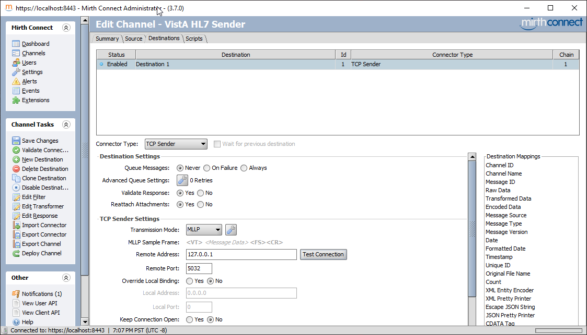

   Mirth Channel Setup Destination

You should click on "Test Connection" to see if there is somebody listening on
the other end.

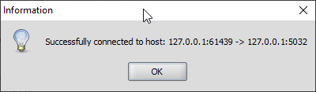

   Mirth Channel Setup Destination - Connection Okay

There is also an encoding parameter which you need to scroll down to reach. If
you are not dealing with ASCII, you should probably explicitly set that.

Click on "Save Changes" under Channel Tasks, and then Deploy Channel. You will
be taken to the Dashboard.

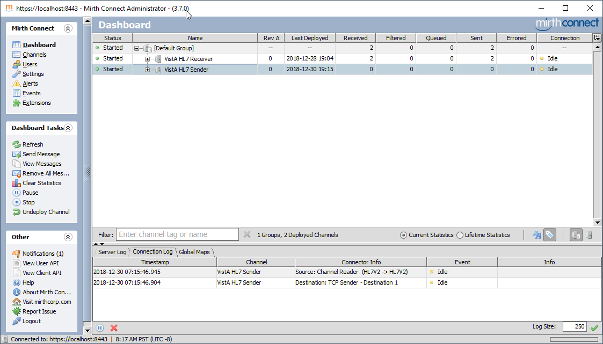

   Mirth Channel Dashboard Send

Send HL7 message
""""""""""""""""
Click on "VistA HL7 Sender", and then on the left hand side, under "Dashboard
Tasks", click on "Send Message". Paste the message we just create, and then
click on Process Message.

   Mirth Send Message

Wait for Reply and View Reply
"""""""""""""""""""""""""""""
If you wait a moment, you will see the "Connection Log" at the bottom update;
and you will also see that Received and Sent Column on the Dashboard will show
up as "1":

   Mirth Dashboard Send Complete

On the right hand side, click on "View Messages" under "Dashboard Tasks", then
click on the row that says "Destination 1". You will see your message in
the bottom pane:

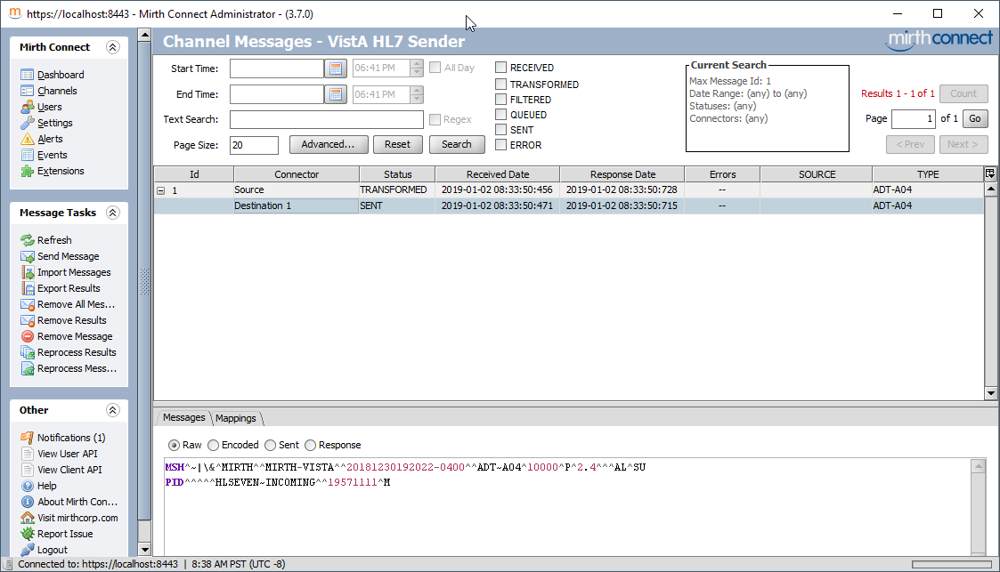

   Mirth Dashboard View Messages Sent

In the bottom pane, where you see the radio buttons that says
"Raw/Encoded/Sent/Response", click on Response. You may need to resize the
Window to see the ACK message:

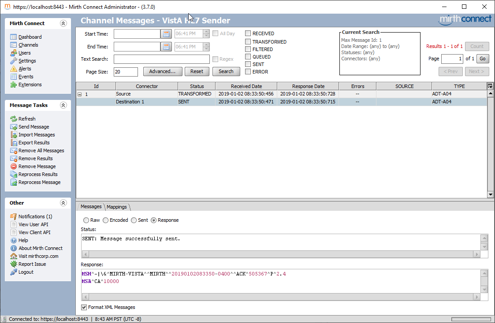

   Mirth Dashboard View Messages Sent's Response with CA

This ACK message is the ACK sent by VistA (CA = Commit Accept). This says that
VistA received the message. But let's say we want an application acknowledgement,
i.e., that VistA PROCESSED, not just received, the message. We can ask for that
by changing the "ACCEPT ACKNOWLEDGEMENT" to "NE", and leaving "APPLICATION
ACKNOWLEDGEMENT" to "SU". 

Resend HL7 message
""""""""""""""""""
The new message looks like this (I adjusted the time
and message counter so that this message isn't treated as a duplicate):::

  MSH^~|\&^MIRTH^^MIRTH-VISTA^^20181230192023-0400^^ADT~A04^10001^P^2.4^^^NE^SU
  PID^^^^^HLSEVEN~INCOMING^^19571111^M

Send this using the same mechanism as before. The ACK will now be an
application ack:

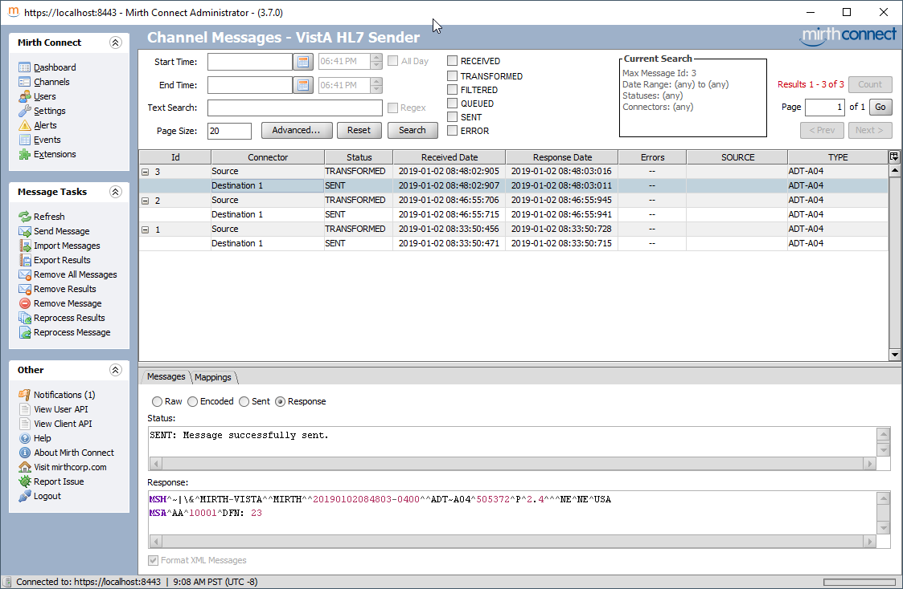

   Mirth Dashboard View Messages Sent's Response with AA

Check VistA for the New Data
""""""""""""""""""""""""""""
The AA says that the DFN is 23. Let's see if you we indeed have that patient
registered with a DFN of 23:::

  FOIA201805>D Q^DI

  MSC FileMan 22.1060

  Select OPTION: INQUIRE TO FILE ENTRIES

  Output from what File: HL LOGICAL LINK// 2  PATIENT  (23 entries)
  Select PATIENT NAME: `23  HLSEVEN,INCOMING,        11-11-57    303111159P **Pseu
  do SSN**     NO     NON-VETERAN (OTHER)
  Another one:
  Standard Captioned Output? Yes//   (Yes)
  Include COMPUTED fields:  (N/Y/R/B): NO//  - No record number (IEN), no Computed
   Fields
  Display Audit Trail? No//   NO

  NAME: HLSEVEN,INCOMING,                 SEX: MALE
    DATE OF BIRTH: 11/11/1957             SOCIAL SECURITY NUMBER: 303111159P
    WHO ENTERED PATIENT: 사용자,하나      DATE ENTERED INTO FILE: JAN 2,2019
    CHECK FOR DUPLICATE: YES              SERVICE CONNECTED?: NO
    INTEGRATION CONTROL NUMBER: 500000022
    ICN CHECKSUM: 892175                  FULL ICN: 500000022V892175
    NAME COMPONENTS: 2
    PSEUDO SSN REASON: SSN UNKNOWN/FOLLOW-UP REQUIRED
    TYPE: NON-VETERAN (OTHER)             VETERAN (Y/N)?: NO

Okay. Things look good. That's it for sending.

Troubleshooting HL7 Issues
--------------------------
Looking at the Link Manager
^^^^^^^^^^^^^^^^^^^^^^^^^^^
The first step in any debugging is to see if the Link Manager shows any messages
being sent/received. There is an example in `Creating a Test Message` section.

Viewing the Messages in VistA
^^^^^^^^^^^^^^^^^^^^^^^^^^^^^
Messages can be viewed using EVE > HL7 Main Menu > Message Management Options >
View Transmission Log (TCP only) [LOG]. Note that the log has a cut-off that is
96 hours by default; I think if you send messages with date/times older than
that in the message header, they get deleted after they get processed. So in
the sample messages presented in this tutorial, you probably want to update the
date/time in the MSH to be today and adjust the time accordingly.

The Messages Viewer is tricky to navigate. Press Tab to move between messages
(shift-tab does not work); and press enter to view a message; press Left-Arrow
to exit a message and back into the messages view. Press F1-E to exit the
messages viewer. Here's a screen scrape:

.. raw:: html

  <pre>Select Message Management Options Option: <strong>LOG</strong>  View Transmission Log (TCP only)

                           Search Transmission Log

       Select one of the following:

            M         Message Search
            P         Pending Transmissions
            E         Error Listing
            Q         Quit (also uparrow, or <RETURN>)

  Selection: <strong>M</strong>essage Search

                          Start/Stop Time Selection

    Enter START Date and Time. Date is required.

  Enter a date and optional time: T// <strong>&lt;enter&gt;</strong>  (JAN 02, 2019)

    Enter END Date and Time. Date is required.

  Enter a date and optional time: NOW// <strong>&lt;enter&gt;</strong>  (JAN 02, 2019@10:59:59)

                         Message Criteria for Search

  Select Status Code for Report:  ALL//<strong>&lt;enter&gt;</strong>

  Select Logical Link for Report:  ALL//<strong>&lt;enter&gt;</strong>

  Select Message Type for Report:  ALL//<strong>&lt;enter&gt;</strong>

  Select Event Type for Report:  ALL//<strong>&lt;enter&gt;</strong>

   . . . PLEASE WAIT, THIS CAN TAKE AWHILE . . .

  MESSAGE ID #         D/T Entered   Log Link   Msg:Evn IO Sndg Apl Rcvr Apl
  505375               010219.112307  VBECSPTU   ADT:A04 OT VAFC PIM VBECS AD
  505376               010219.112307  MEMPHIS    ADT:A04 OT VAFC PIM NETCAT

  HYPER-TXT|Press <F1>H for help| Line>        2 of 2   Screen>        1 of 1
                                      MESSAGE
  Record #: 5376                Message #: 505376
  D/T Entered: 010219.112307    D/T Processed: 010219.11231
  Logical Link: MEMPHIS         Ack To MSG#: 505376
  D/T STATUS: 010219.11231      STATUS: SUCCESSFULLY COMPLETED
  ERR MSG:                      ERR TYPE:
  Sending Appl: VAFC PIMS
  Receiving Appl: NETCAT
  Message Type: ADT             Event Type: A04
  MESSAGE HEADER:
  MSH^~|\&^VAFC PIMS^50^NETCAT^^20190102112307-0400^^ADT~A04^505376^P^2.3^^^NE^NE^USA
  MESSAGE TEXT:
  EVN^A04^20190102112307-0400^^^1~사용자~하나

  PID^1^500000001V075322^1~8~M10^1155P^마우스~미키^""^19551111^M^^""~~0005~""~~CDC^ 東京中央郵便局~ 東京都中央区八重洲一丁目5番3号 ~東京中央郵便局~東~100-8994~JAPAN~P~""~""|""~""~""~""~""~~VACAE~""~""~~~""&""|""~""~""~""~""~~VACAA~""~""~~|
  ""~""~""~""~""~~VACAM~""~""~~~""&""|""~""~""~""~""~~VACAO~""~""~~~""&""^^""^""^^""^29^^505111155P^^^""~~0189~""~~CDC^

  PD1^^^PLATINUM~~050^""

  PV1^1^O^""^^^^^^^^^^^^^^^NON-VETERAN (OTHER)^^^^^^^^^^^^^^^^^^^^^^^^^^^^^^^^113

  OBX^1

  HYPER-TXT|Press <F1>H for help| Line>       22 of 38  Screen>        1 of 2</pre>

Reprocessing a Message
^^^^^^^^^^^^^^^^^^^^^^
You can use ``$$REPROC^HLUTIL(message ien,"processing routine")`` to re-process
an incoming HL7 message. This is useful when developing processing code. Here's
an example of re-processing an incoming message. I got the message number by
following the instructions in `Viewing the Messages in VistA`. The field
containing the message IEN is "Record #".

::

  FOIA201805>ZB ADTA04^OSEHL7

  FOIA201805>ZWRITE ^HLMA(5380,*)
  ^HLMA(5380,0)="5390^10003^I^^^5380^79^5105^^^241^242^6^4"
  ^HLMA(5380,2)="^3190102.114008"
  ^HLMA(5380,"MSH",0)="^^1^1^3190102^"
  ^HLMA(5380,"MSH",1,0)="MSH^~|\&^MIRTH^^MIRTH-VISTA^^20190102140000-0400^^ADT~A04
  ^10003^P^2.4^^^NE^SU"
  ^HLMA(5380,"P")="3^3190102.114008"
  ^HLMA(5380,"S")="3190102.114008^^^^^3190102.114008^3190102.114008"

  FOIA201805>W $$REPROC^HLUTIL(5380,"ADTA04^OSEHL7")
  %GTM-I-BREAKZBA, Break instruction encountered during ZBREAK action
                  At M source location ADTA04+2^OSEHL7

  FOIA201805>ZST INTO
   F I=1:1 X HLNEXT Q:HLQUIT'>0  D
  %GTM-I-BREAKZST, Break instruction encountered during ZSTEP action
                  At M source location ADTA04+3^OSEHL7

  FOIA201805>ZST INTO
   K HLNODE
  %GTM-I-BREAKZST, Break instruction encountered during ZSTEP action
                  At M source location HLNEXT+8^HLCSUTL

  FOIA201805>ZST INTO
   N HLI,HLDONE,HLX
  %GTM-I-BREAKZST, Break instruction encountered during ZSTEP action
                  At M source location HLNEXT+9^HLCSUTL

  FOIA201805>ZST OUTOF
   . I $P(HLNODE,HL("FS"))="PID" D
  %GTM-I-BREAKZST, Break instruction encountered during ZSTEP action
                  At M source location ADTA04+4^OSEHL7

  FOIA201805>W HLNODE
  MSH^~|\&^MIRTH^^MIRTH-VISTA^^20190102140000-0400^^ADT~A04^10003^P^2.4^^^NE^SU
  FOIA201805>ZC
    303111259P0

Debugging Code
^^^^^^^^^^^^^^
Before running any of this, you need to turn off all background messaging tasks,
as these will process your messages before you have a chance to touch them.
Do that using EVE > HL7 Main Menu > Filer and Link Management Options >
Stop All Messaging Background Processes [SA] and then 
TCP Link Manager Start/Stop [LM].

If you are using xinetd, you need to stop the xinetd as well (or at least
disable the HL7 listener).

Most of these debug methods rely on you knowing the IEN of the Logical Link
that will receive the messages. Inquire into file 'HL LOGICAL LINK' and ask
for the record numbers. Here are my numbers:::

  FOIA201805>D P^DI

  MSC FileMan 22.1060

  Select OPTION: INQUIRE TO FILE ENTRIES

  Output from what File: HL LOWER LEVEL PROTOCOL TYPE// HL LOGICAL LINK
                                            (78 entries)
  Select HL LOGICAL LINK NODE: MEMPHIS
  Another one: SLISTENER
  Another one: LISTENER
  Another one:
  Standard Captioned Output? Yes//   (Yes)
  Include COMPUTED fields:  (N/Y/R/B): NO// Record Number (IEN)

  NUMBER: 78                              NODE: MEMPHIS
    LLP TYPE: TCP                         DEVICE TYPE: Non-Persistent Client
    STATE: Shutdown                       TIME STOPPED: JAN 2,2019@12:01:47
    SHUTDOWN LLP ?: YES                   QUEUE SIZE: 10
    READ TIMEOUT: 1                       ACK TIMEOUT: 1
    TCP/IP ADDRESS: 127.0.0.1             TCP/IP PORT: 6661
    TCP/IP SERVICE TYPE: CLIENT (SENDER)  IN QUEUE BACK POINTER: 1
    IN QUEUE FRONT POINTER: 1             OUT QUEUE BACK POINTER: 7
    OUT QUEUE FRONT POINTER: 7

  NUMBER: 79                              NODE: SLISTENER
    LLP TYPE: TCP                         DEVICE TYPE: Single-threaded Server
    STATE: Shutdown                       TIME STOPPED: JAN 2,2019@12:02:10
    SHUTDOWN LLP ?: YES                   QUEUE SIZE: 10
    TCP/IP PORT: 5032                     TCP/IP SERVICE TYPE: SINGLE LISTENER
    IN QUEUE BACK POINTER: 5              IN QUEUE FRONT POINTER: 5
    OUT QUEUE BACK POINTER: 5             OUT QUEUE FRONT POINTER: 5

  NUMBER: 4                               NODE: LISTENER
    LLP TYPE: TCP                         DEVICE TYPE: Multi-threaded Server
    STATE: 2 server                       AUTOSTART: Enabled
    MAILMAN DOMAIN: FOIA.DOMAIN.EXT       TIME STOPPED: APR 12,2018@13:59:35
    SHUTDOWN LLP ?: YES                   QUEUE SIZE: 10
    RE-TRANSMISSION ATTEMPTS: 5           READ TIMEOUT: 600
    ACK TIMEOUT: 600                      EXCEED RE-TRANSMIT ACTION: shutdown
    TCP/IP ADDRESS: 127.0.0.1             TCP/IP PORT: 5030
    TCP/IP SERVICE TYPE: MULTI LISTENER   IN QUEUE BACK POINTER: 236
    IN QUEUE FRONT POINTER: 235           OUT QUEUE BACK POINTER: 903
    OUT QUEUE FRONT POINTER: 903

Debugging Messages to Send
""""""""""""""""""""""""""
First, run the code that will create the message and put it in the VistA HL7
Engine (typically via ``GENERATE^HLMA``). Once that's done, you can debug the
sending of the message by setting HLDP to the IEN of the Logical Link, and then
running ``D ^HLCSTCP``. Set a breakpoint in the appropriate place to debug.
This example creates an ADT-A04 for DFN #20 and steps through sending it for
the logical link "MEMPHIS".

::

  $ mumps -dir

  FOIA201805>S DUZ=1

  FOIA201805>D ^XUP

  Setting up programmer environment
  This is a TEST account.

  Terminal Type set to: C-VT220

  Select OPTION NAME:
  FOIA201805>N % S %=$$EN^VAFCA04(20,$$NOW^XLFDT)

  FOIA201805>ZB ^HLCSTCP

  FOIA201805>S HLDP=78

  FOIA201805>D ^HLCSTCP
  %GTM-I-BREAKZBA, Break instruction encountered during ZBREAK action
                  At M source location HLCSTCP+7^HLCSTCP

  FOIA201805>ZST INTO
   L +^HLCS("HLTCPLINK",HLDP):5 I '$T D  Q
  %GTM-I-BREAKZST, Break instruction encountered during ZSTEP action
                  At M source location HLCSTCP+9^HLCSTCP

Debugging Messages to Receive via Single Listener
"""""""""""""""""""""""""""""""""""""""""""""""""
This is very similar to Sending, except that you will put a breakpoint on
the code that will process the message. The start of the processing is in
``SERVER^HLCSTCP``, but almost always you will want to start with
``PROCESS^HLCSTCP1``, as you may not receive the message in full because the
other end will time out.

::

  FOIA201805>S DUZ=1

  FOIA201805>D ^XUP

  Setting up programmer environment
  This is a TEST account.

  Terminal Type set to: C-VT220

  Select OPTION NAME:
  FOIA201805>zb SERVER^HLCSTCP

  FOIA201805>S HLDP=79

  FOIA201805>D ^HLCSTCP ; Now, send the message from outside.
  %GTM-I-BREAKZBA, Break instruction encountered during ZBREAK action
                  At M source location SERVER^HLCSTCP
  %GTM-W-NOTPRINCIO, Output currently directed to device SCK$95524

Debugging Messages to Receive via Multi Listener
""""""""""""""""""""""""""""""""""""""""""""""""
Not really; we will just fake out a new listener by writing some new code.
This is a bit harder, but so maybe you may be better off using the Single
Listener, which doesn't require any code changes. This example is for GT.M;
the process is similar for Cache, but this exact code won't work. 
That's just a convenience and can be removed. Add this code in HLCSGTM:::

  DEBUG ;Entry point for debug, Build a server to get the connect
   W !,"IP Socket to Listen on: " R SOCK:300,! Q:'$T!(SOCK["^")
   ;Use %ZISTCP to do a single server
   D LISTEN^%ZISTCP(SOCK,"SERV^HLCSGTM")
   U $P W !,"Done"
   Q
   ;
  SERV ;
   S U="^",$ZT="",$ET="D ^%ZTER HALT" ;Setup the error trap
   ; GTM specific code
   X "U IO:(nowrap:nodelimiter:IOERROR=""TRAP"")" ;Setup device
   S @("$ZINTERRUPT=""I $$JOBEXAM^ZU($ZPOSITION)""")
   K ^TMP($J) ZSHOW "D":^TMP($J)
   F %=1:1 Q:'$D(^TMP($J,"D",%))  S X=^(%) Q:X["LOCAL"
   S IO("IP")=$P($P(X,"REMOTE=",2),"@"),IO("PORT")=+$P($P(X,"LOCAL=",2),"@",2)
   S %=$P($ZTRNLNM("SSH_CLIENT")," ") S:%="" %=$ZTRNLNM("REMOTEHOST")
   S HLDP=$ORDER(^HLCS(870,"E","M",0))
   D LISTEN^HLCSTCP
   QUIT

As before, you should probably put a breakpoint at ``PROCESS^HLCSTCP1``. Then
run ``D DEBUG^HLCSGTM``, and put it any port number (as long as you configure
Mirth to send to it):::

  FOIA201805>D DEBUG^HLCSGTM

  IP Socket to Listen on: 5035
  %GTM-I-BREAKZBA, Break instruction encountered during ZBREAK action
                  At M source location PROCESS+2^HLCSTCP1
  %GTM-W-NOTPRINCIO, Output currently directed to device SCK$95524

Programmer's Guide to Creating and Parsing HL7 Messages
-------------------------------------------------------
Creating Outgoing HL7 Messages
^^^^^^^^^^^^^^^^^^^^^^^^^^^^^^
To be written at a future date.

Processing Incoming HL7 Messages
^^^^^^^^^^^^^^^^^^^^^^^^^^^^^^^^
To be written at a future date.

