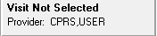
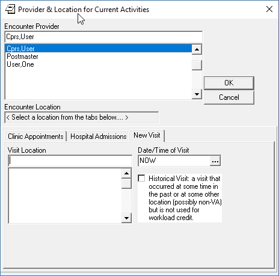
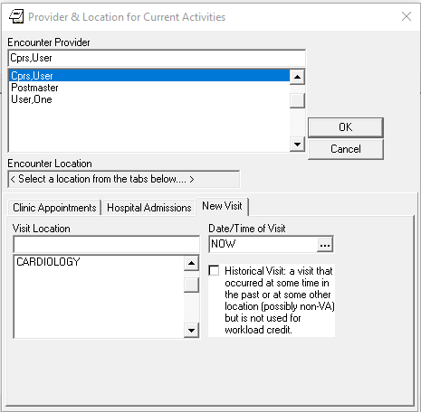

Set-up Clinics
==============

Authors: Sam Habiel

License: |license|

.. |license| image:: https://i.creativecommons.org/l/by/4.0/80x15.png 
   :target: http://creativecommons.org/licenses/by/4.0/ 

Last updated in May 2018.

If you have reached this point, it means that you have finished `VistA
Initialization <./InitializeVistA.html>`_.

If you logged in to CPRS, and tried to create an encounter (a.k.a. Visit), by
clicking on this:

You will see the following:

We have users populated; but we do not have any clinics to choose for a visit
location. 

Before we get started, we need to define what "clinic" means. It's not a
physical building; nor it is a specific room or wing in a hospital. It really
stands for an administrive unit in a specific speciality at which patients can
be scheduled for appointments. "Clinic" in English also means the entire
building in which these specialties are housed; but that's not what it means in VistA.

Examples of VistA Clinics:

* Cardiology Clinic
* Dr. Boson's Clinic (single physician clinic)
* Dermatology Clinic
* Immunization Update Clinic
* Public Nurse Visits Clinic

In order for us to create a new clinic, we need to log-in as a
system manager into the "roll and scroll" and set-up a new clinic. To get to
the menu, you need to go from:

.. raw:: html

  
<code>
   Core Applications &rarr; Scheduling Manager's Menu &rarr; Supervisor Menu &rarr; Set up a Clinic</code>

Here's a walk through the menu system showing you getting there:

.. raw:: html

  
<code>
  sam@icarus:/var/local/foia201802$ <strong>mumps -r ZU</strong>
  NEW SYSTEM 304-262-7078

  Volume set: ICARUS:foia.2018.02  UCI: FOIA201802  Device: /dev/pts/1

  ACCESS CODE: <strong>******</strong>
  VERIFY CODE: <strong>*********</strong>

  Good morning USER,ONE
       You last signed on today at 10:50
  There was 1 unsuccessful attempt since you last signed on.

            Core Applications ...
            Device Management ...
            Menu Management ...
            Programmer Options ...
            Operations Management ...
            Spool Management ...
            Information Security Officer Menu ...
            Taskman Management ...
            User Management ...
            Application Utilities ...
            Capacity Planning ...
            HL7 Main Menu ...

  Select Systems Manager Menu <TEST ACCOUNT> Option: <strong>Core</strong> Applications

     DENT   Dental ...
     EN     Engineering Main Menu ...
     FEE    Fee Basis Main Menu ...
     FH     Dietetic Administration ...
     GECO   Miscellaneous Code Sheet Manager Menu ...
     GECS   Generic Code Sheet Menu ...
     GMRA   Adverse Reaction Tracking ...
     IB     Integrated Billing Master Menu ...
     MCAR   Medicine Menu ...
     NU     Nursing System Manager's Menu ...
     PDX    Patient Data Exchange ...
     PROS   Prosthetic Official's Menu ...
     PRPF   Patient Funds (INTEGRATED) System ...
     RA     Rad/Nuc Med Total System Menu ...
     ROES   Remote Order/Entry System ASPS Menu ...
     RT     Record Tracking Total System Menu ...
     SR     Surgery Menu ...
     SW     Information Management Systems (SWIMS) ...
     TIU    TIU Maintenance Menu ...
     VMAS   Volunteer Timekeeping Activity ...
     VOL    Volunteer Master Menu ...
     YSM    MHS Manager ...

                 Press 'RETURN' to continue, '^' to stop: <strong>Return</strong>
     YSU    Mental Health ...
            ADT Manager Menu ...
            Automatic Replenishment ...
            CPRS Manager Menu ...
            CPRS Menu
            Employee Menu ...
            Finance AR Manager Menu ...
            Health Summary Coordinator's Menu ...
            Health Summary Enhanced Menu ...
            Health Summary Menu ...
            IV Menu ...
            Library Management ...
            National Drug File Menu ...
            Outpatient Pharmacy Manager ...
            Payroll Main Menu ...
            Payroll Supervisor Menu ...
            Scheduling Manager's Menu ...
            Serials Control ...
            Unit Dose Medications ...

  Select Core Applications <TEST ACCOUNT> Option: <strong>Scheduling</strong> Manager's Menu

  Scheduling Version 5.3

     ACR    Ambulatory Care Reporting Menu ...
            Appointment Menu ...
            Automated Service Connected Designation Menu ...
            Outputs ...
            Supervisor Menu ...
            VistA Scheduling GUI Resource Mgmt Report Data

  Select Scheduling Manager's Menu <TEST ACCOUNT> Option: <strong>Supervisor</strong> Menu

            Add/Edit a Holiday
            Appointment Status Update Menu ...
            Appointment Waiting Time Report
            Cancel Clinic Availability
            Change Patterns to 30-60
            Convert Patient File Fields to PCMM
            Current MAS Release Notes
            Enter/Edit Letters
            Inactivate a clinic
            Look up on Clerk Who Made Appointment
            Non-Conforming Clinics Stop Code Report
            Print Clinic Installation Checklist
            Purge Scheduling Data
            Reactivate a Clinic
            Remap Clinic
            Restore Clinic Availability
            Scheduling Parameters
            Set up a Clinic
            Sharing Agreement Category Update

  Select Supervisor Menu <TEST ACCOUNT> Option: <strong>Set</strong> up a Clinic</code>

We should technically create form letters for the clinic using the option
``Enter/Edit Letters`` before we start, but we will leave that as an exercise
for the reader.

These fields are *required*:

* CLINIC NAME
* SERVICE
* NON-COUNT CLINIC
* STOP CODE NUMBER
* DEFAULT APPOINTMENT TYPE
* ALLOWABLE CONSECUTIVE NO-SHOWS
* MAX # DAYS FOR FUTURE BOOKING
* MAX # DAYS FOR AUTO-REBOOK
* OVERBOOKS/DAY MAXIMUM
* LENGTH OF APP'T

You will be asked first a bunch of questions, then you will come to a section
called "Availability" in which you set-up the number of patient slots for
your clinic. We will pause there for an explanation of the syntax.

Text in italics is commentary. As always, ? and ?? will show you more information on each field.

.. raw:: html

  
<code>Select CLINIC NAME: <strong>CARDIOLOGY</strong>
    Are you adding 'CARDIOLOGY' as a new HOSPITAL LOCATION? No// <strong>Y</strong>  (Yes)
  NAME: CARDIOLOGY// <strong>&lt;enter&gt;</strong>
  ABBREVIATION: <strong>&lt;enter&gt;</strong>
  PATIENT FRIENDLY NAME: <strong>&lt;enter&gt;</strong>
  CLINIC MEETS AT THIS FACILITY?: Y// <strong>&lt;enter&gt;</strong>  YES
  ALLOW DIRECT PATIENT SCHEDULING?: <strong>Y</strong>  YES
  SERVICE: <strong>??</strong>
       Choose from: 
         M        MEDICINE
         S        SURGERY
         P        PSYCHIATRY
         R        REHAB MEDICINE
         N        NEUROLOGY
         0        NONE
  SERVICE: <strong>M</strong>  MEDICINE
  
  <i>You must type N here for proper crediting.</i>
  NON-COUNT CLINIC? (Y OR N): <strong>N</strong>  NO
  
  <i>The next two questions are important: The STOP CODE is used for statistics;
  the DEFAULT APPOINTMENT TYPE is used by Scheduling</i>
  STOP CODE NUMBER: <strong>CARDIOLOGY</strong>       303
  DEFAULT APPOINTMENT TYPE: REGULAR//  <strong>&lt;enter&gt;</strong> 
  ADMINISTER INPATIENT MEDS?: <strong>&lt;enter&gt;</strong>
  TELEPHONE: <strong>222-333-4444</strong>
  TELEPHONE EXTENSION: <strong>&lt;enter&gt;</strong>
  REQUIRE X-RAY FILMS?: <strong>&lt;enter&gt;</strong>
  
  <i>Action profiles are printed sheets of paper containing a patient's 
  medications. No, I don't think we want them.</i>
  REQUIRE ACTION PROFILES?: YES// <strong>N</strong>  NO
  
  <i>If we created letters, we would put them here</i>
  NO SHOW LETTER: <strong>&lt;enter&gt;</strong>
  PRE-APPOINTMENT LETTER: <strong>&lt;enter&gt;</strong>
  CLINIC CANCELLATION LETTER: <strong>&lt;enter&gt;</strong>
  APPT. CANCELLATION LETTER: <strong>&lt;enter&gt;</strong>
  
  <i>The next five quetions are only used if clerks check out patients (check 
  out = do some work after the visit is done)</i>
  ASK FOR CHECK IN/OUT TIME: <strong>N</strong>  NO
  Select PROVIDER: <strong>&lt;enter&gt;</strong>
  DEFAULT TO PC PRACTITIONER?: <strong>&lt;enter&gt;</strong>
  Select DIAGNOSIS: <strong>&lt;enter&gt;</strong>
  WORKLOAD VALIDATION AT CHK OUT: <strong>&lt;enter&gt;</strong>
  
  <i>The next few questions have to do with configuration of scheduling 
  patients for the clinic</i>
  ALLOWABLE CONSECUTIVE NO-SHOWS: <strong>5</strong> 
  MAX # DAYS FOR FUTURE BOOKING: <strong>180</strong>
  HOUR CLINIC DISPLAY BEGINS: <strong>9</strong>
  START TIME FOR AUTO REBOOK: <strong>13</strong>
  MAX # DAYS FOR AUTO-REBOOK: <strong>60</strong>
  SCHEDULE ON HOLIDAYS?: <strong>&lt;enter&gt;</strong>
  CREDIT STOP CODE: <strong>&lt;enter&gt;</strong>
  PROHIBIT ACCESS TO CLINIC?: <strong>&lt;enter&gt;</strong>
  PHYSICAL LOCATION: <strong>&lt;enter&gt;</strong>
  PRINCIPAL CLINIC: <strong>&lt;enter&gt;</strong>
  OVERBOOKS/DAY MAXIMUM: <strong>2</strong>
  
  <i>The next field is to put in instructions for clerks (e.g. make sure 
  patients get LDL done before seeing Dr. Lewis)</i>
  Select SPECIAL INSTRUCTIONS: <strong>&lt;enter&gt;</strong>
  
  <i>The next 3 questions deal with how long appointments are, and how to 
  display the appointment increments</i>
  LENGTH OF APP'T: <strong>30</strong>
  VARIABLE APP'NTMENT LENGTH: <strong>Y</strong>  YES, VARIABLE LENGTH
  DISPLAY INCREMENTS PER HOUR: 4// <strong>2</strong>  30-MIN </code>

The next section needs some explanation before we show it: The scheduling 
interface VistA has displays appointment slots like this:

.. raw:: html

  
<code>[1] [1] [1] [1] [1] [1] [1] [1] [1] [1] [1] [1] [1] [1] [1] [1]</code>

This means that every time period (here, 30 minutes) has 1 appointment available.
If you have multiple physicians in the CARDIOLOGY clinic, you can have more than
1 slot available. Let's say you have 3 physicians. Then you can set-up your slots
to look like this:

.. raw:: html

  
<code>[5] [5] [5] [5] [5] [5] [5] [5] [5] [5] [5] [5] [5] [5] [5] [5]</code>

When you use up one slot, what's left is 4 in the specific slot:

.. raw:: html

  
<code>[5] [4] [5] [5] [5] [5] [5] [5] [5] [5] [5] [5] [5] [5] [5] [5]</code>

The other thing to keep in mind is that you book a clinic by day of week, even
though it doesn't look like it. You actually put a day, and it will ask you
if it can use this pattern for all future appointments for this day of week. I
wrote this document on a Monday, so putting "T" will stand for Mondays, and "T+1"
will stand for Tuesdays, etc.

You are asked for "TIME" multiple times. The idea is that you can go from--say--
9am to 12pm, and then from 1pm to 5pm.

With these explanations behind us, here is a simple set-up:

.. raw:: html

  
<code>AVAILABILITY DATE: <strong>T</strong>  (MAY 07, 2018)

                                       MONDAY

    TIME: <strong>0900-1700</strong>   NO. SLOTS: 1//  <strong>&lt;enter&gt;</strong>

    TIME: <strong>&lt;enter&gt;</strong>
  [1] [1] [1] [1] [1] [1] [1] [1] [1] [1] [1] [1] [1] [1] [1] [1] 
  ...PATTERN OK FOR MONDAYS INDEFINITELY? <strong>Y</strong>  (Yes)
  ...HMMM, I'M WORKING AS FAST AS I CAN...
  PATTERN FILED!

  AVAILABILITY DATE: <strong>T+1</strong>  (MAY 08, 2018)

                                       TUESDAY

    TIME: <strong>0900-1700</strong>   NO. SLOTS: 1//  <strong>&lt;enter&gt;</strong>

    TIME: <strong>&lt;enter&gt;</strong>
  [1] [1] [1] [1] [1] [1] [1] [1] [1] [1] [1] [1] [1] [1] [1] [1] 
  ...PATTERN OK FOR TUESDAYS INDEFINITELY? <strong>Y</strong>  (Yes)
  ...HMMM, HOLD ON...
  PATTERN FILED!

  AVAILABILITY DATE: <strong>T+2</strong>  (MAY 09, 2018)

                                       WEDNESDAY

    TIME: <strong>1300-1700</strong>   NO. SLOTS: 1//  <strong>&lt;enter&gt;</strong>

    TIME: <strong>&lt;enter&gt;</strong>
  |       |       |       |       [1] [1] [1] [1] [1] [1] [1] [1] 
  ...PATTERN OK FOR WEDNESDAYS INDEFINITELY? <strong>Y</strong>  (Yes)
  ...SORRY, JUST A MOMENT PLEASE...
  PATTERN FILED!

  AVAILABILITY DATE: <strong>T+3</strong>  (MAY 10, 2018)

                                       THURSDAY

    TIME: <strong>0900-1700</strong>   NO. SLOTS: 1//  <strong>&lt;enter&gt;</strong>

    TIME: <strong>&lt;enter&gt;</strong>
  [1] [1] [1] [1] [1] [1] [1] [1] [1] [1] [1] [1] [1] [1] [1] [1] 
  ...PATTERN OK FOR THURSDAYS INDEFINITELY? <strong>Y</strong>  (Yes)
  ...HMMM, JUST A MOMENT PLEASE...
  PATTERN FILED!

  AVAILABILITY DATE: <strong>T+4</strong>  (MAY 11, 2018)

                                       FRIDAY

    TIME: <strong>0900-1700</strong>   NO. SLOTS: 1//  <strong>&lt;enter&gt;</strong>

    TIME: <strong>&lt;enter&gt;</strong>
  [1] [1] [1] [1] [1] [1] [1] [1] [1] [1] [1] [1] [1] [1] [1] [1] 
  ...PATTERN OK FOR FRIDAYS INDEFINITELY? <strong>Y</strong>  (Yes)
  ...EXCUSE ME, JUST A MOMENT PLEASE...
  PATTERN FILED!

  AVAILABILITY DATE: <strong>&lt;enter&gt;</strong>

  Select CLINIC NAME:<strong>&lt;enter&gt;</strong></code>

At this point, we are done with creating a clinic. If you look in CPRS, you will
find that the clinic now exists, and you can create a visit in CPRS:

