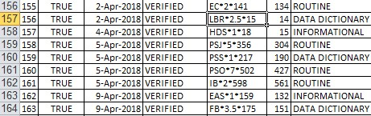

Updating A VistA System
=======================
Authors: Sam Habiel

License: |license|

.. |license| image:: https://i.creativecommons.org/l/by/4.0/80x15.png 
   :target: http://creativecommons.org/licenses/by/4.0/ 

Last updated in December 2018.

  While none of the previous sections are required for completing this section,
  you need to set-up the ``OPEN PARAMETERS`` of the HFS device entry as KIDS
  won't work without it. Look in `VistA Initialization
  <./InitializeVistA.html#hfs-device>`_ HFS Device section. Also, you need to
  know how to get to the ``EVE`` menu. For the purposes of this section,
  setting your DUZ and running ``D ^XUP`` works fine.

Introduction to KIDS
--------------------
A VistA system, like a new car, is old by the time you drive it. One of the big
challenges for new users for VistA is understanding the large amount of
on-going updates. Almost always, without exception, new users of VistA tend to
fall behind on patching when first implementing the system. There is no
automated system to apply updates (see the last section for discussion); so it
takes some discipline to keep up on the VistA updates. I do acknowledge that
the situation needs to be improved. The system that is used to update VistA is
the Kernel Installation Distribution System (KIDS). KIDS consists of files or
mail messages (rare for people outside of the VA) that you load into a VistA
system.

There are many concepts that reference each other; and while I try to go in an
order that makes sense, it may help to read this twice.

Most of the document discusses how to install a KIDS build. The end of the
document discusses how to acquire all the KIDS builds to bring your VistA up
to date; you can jump there now if you wish: `Patching up an old VistA System`_.

Quick TL;DR
^^^^^^^^^^^
TL;DR = Internet Slang for Too Long; Didn't Read

If you just want to know how to install a KIDS build, here are the steps:

Outside of VistA:

1. Download the KIDS build file.
2. If running on GT.M/YottaDB, ``dos2unix`` the file.
3. Note the path to the file. On Linux & Cygwin, you can get the path using ``readlink -f {filename}``;
   on Windows, typing Win+R to open the run box and dragging the file there will do the trick.

Inside of VistA:

Prerequisite: ``XUPROG`` security key.

1. Log in to EVE
2. Programmer Options
3. KIDS
4. Installation
5. Load a Distribution (loads the KIDS build). Supply the path.
6. Install Package(s) (installs the KIDS build). Supply default answers.

An even shorter way to install a KIDS build is to run ``D ^XPDIL,^XPDI`` from
direct mode (aka programmer mode). This runs steps 5 and 6.

Here's an example starting from after logging in as the system manager with
``EVE`` as the main menu. Responses are in bold.

.. raw:: html

  
<code>
          Core Applications ...
          Device Management ...
          Menu Management ...
          Programmer Options ...
          Operations Management ...
          Spool Management ...
          Information Security Officer Menu ...
          Taskman Management ...
          User Management ...
          Application Utilities ...
          Capacity Planning ...
          HL7 Main Menu ...

  Systems Manager Menu: <strong>Prog</strong>rammer Options

   KIDS   Kernel Installation & Distribution System ...
   PG     Programmer mode
          Delete Unreferenced Options
          Error Processing ...
          Global Block Count
          Routine Tools ...

  Programmer Options: <strong>KIDS</strong>  Kernel Installation & Distribution System

          Edits and Distribution ...
          Utilities ...
          Installation ...
          Patch Monitor Main Menu ...

  Kernel Installation & Distribution System: <strong>I</strong>nstallation

   1      Load a Distribution
   2      Verify Checksums in Transport Global
   3      Print Transport Global
   4      Compare Transport Global to Current System
   5      Backup a Transport Global
   6      Install Package(s)
          Restart Install of Package(s)
          Unload a Distribution

  Installation: <strong>1</strong> Load a Distribution

  Enter a Host File: <strong>/tmp/GMRV-5_SEQ-29_PAT-37.kids</strong>

  Released GMRV*5*37 SEQ #29
  Comment: Extracted from mail message

  This Distribution contains Transport Globals for the following Package(s):
     GMRV*5.0*37
  Distribution OK!

  Want to Continue with Load? 예// <strong>y</strong>  예
  Loading Distribution...

     GMRV*5.0*37
  Use INSTALL NAME: GMRV*5.0*37 to install this Distribution.

     1      Load a Distribution
     2      Verify Checksums in Transport Global
     3      Print Transport Global
     4      Compare Transport Global to Current System
     5      Backup a Transport Global
     6      Install Package(s)
            Restart Install of Package(s)
            Unload a Distribution

  Installation: <strong>6</strong>  Install Package(s)
  Select INSTALL NAME: <strong>GMRV*5.0*37</strong>       Loaded from Distribution    2018-12-22@12
  :02:02
       => Extracted from mail message  ;Created on

  This Distribution was loaded on 2018-12-22@12:02:02 with header of
     Extracted from mail message  ;Created on
     It consisted of the following Install(s):
      GMRV*5.0*37
  Checking Install for Package GMRV*5.0*37

  Install Questions for GMRV*5.0*37

  Want KIDS to INHIBIT LOGONs during the install? 아니오// <strong>&lt;enter&gt;</strong>
  Want to DISABLE Scheduled Options, Menu Options, and Protocols? 아니오//<strong>&lt;enter&gt;</strong>

  Enter the Device you want to print the Install messages.
  You can queue the install by enter a 'Q' at the device prompt.
  Enter a '^' to abort the install.

  DEVICE: HOME// <strong>;p-other;</strong>  CONSOLE

   Install Started for GMRV*5.0*37 :
                 2018-12-22@12:02:36

  Build Distribution Date: 2018-01-10

   Installing Routines:..
                 2018-12-22@12:02:36

   Running Post-Install Routine: EN^GMV37PST.

  Updating system parameters.

   Updating Routine file......

   Updating KIDS files.......

   GMRV*5.0*37 Installed.
                 2018-12-22@12:02:36

   Not a VA primary domain

   NO Install Message sent

     1      Load a Distribution
     2      Verify Checksums in Transport Global
     3      Print Transport Global
     4      Compare Transport Global to Current System
     5      Backup a Transport Global
     6      Install Package(s)
            Restart Install of Package(s)
            Unload a Distribution

   Installation:</code>

Long Story
^^^^^^^^^^
KIDS was invented by Ron DiMecili for CHCS (a VistA derivative for the DoD)
while working for SAIC. Before KIDS existed, VistA (known in those days as the
Decentralized Hospital Computer Program [DHCP]) used a technology called DIFROM
to transport routines/data between two systems. DIFROM, as it name indicates,
is part of Fileman (DI in the name is the namespace for Fileman). DIFROM
transported data as routines, as routines were one of the few early
standardized ways to share data between different M systems. By the time KIDS
came around in the mid 90s, VistA systems were all networked to each other via
Mailman (i.e.  SMTP); and M systems were by now running on an operating system
rather than being the only thing that ran on a machine--so the concept of files
on a file system was well-developed by then.  The data format that KIDS uses
looks like the global output format that is a lowest common denominator
standard between M implementations. 

As state earlier, in the VA single builds are transported as mail messages;
whereas outside of the VA, most builds are transported as files.  Incidentally,
the header and footer for the formats for the mail messages is not
identical--there are some minor differences compared with the KIDS file. The
mail message format is called "Packman" for reasons unknown to me.

How to Identify KIDS files
^^^^^^^^^^^^^^^^^^^^^^^^^^
KIDS files are easy to identify. The extension is a .kid[s] and the first few
lines look like this:

::

  Released GMRV*5*37 SEQ #29
  Extracted from mail message
  **KIDS**:GMRV*5.0*37^

  **INSTALL NAME**
  GMRV*5.0*37
  "BLD",10542,0)
  GMRV*5.0*37^GEN. MED. REC. - VITALS^0^3180110^y
  "BLD",10542,1,0)
  ^^2^2^3180108^
  "BLD",10542,1,1,0)
  This patch will resolve the following issues in the Vitals Lite DLL

The "patch name" ``GMRV*5.0*37`` consists of three pieces: ``GMRV`` is the
package namespace (a package namespace is the place where the package code
lives); ``5.0`` is the package version; and ``37`` is the patch number. We need
to note that patches in VistA are not real patches in the Unix sense: They are
whole replacements of parts of a program; not line additions and deletions.
Thus the name "patch" for KIDS files is misleading. Originally, there was a
difference between a whole version release of a package (where the KIDS file
would be known as a package) and a release of a patch to a package (where the
KIDS file would be known as a patch). Since most KIDS files are patches; they
now tend to be called KIDS patches, even in the rare case when the KIDS file
actually transports a package not a patch.

Let's talk about the so-called "Sequence Numbers". The first line contains this
information: ``GMRV*5*37 SEQ #29``. SEQ #29 means that this patch should be
applied as the 29th in order for the vitals package. This is because it's
possible to release patches where the patch number does not correspond to the
order in which the patches should be installed, as patch numbers are assigned
when development starts, not when it completes. In other words, patch numbers
are assigned when you start working on something; but if you are working on a
new feature, it can take much longer to release than a simple bug fix. For
examples, if you head over
`here<https://foia-vista.osehra.org/Patches_By_Application/GMRV-VITALS/>`_, you
will notice that patch 35 has sequence number 24, whereas patch 27 has sequence
number 25. That means, in spite of patch 35 seeming to be later than patch 27,
what you really need to do is apply patch 35 first, then patch 27, since it has
the earlier sequence number.

Astute observers will note that the 5 contains a ``.0`` in some places and not
in others. Different systems may allow or not allow the ``.0`` when there isn't
a decimal.

Due to the fact that sequence numbers are what tells people what order to
install patches in, when patches are stored in files, file names put the
sequence number first so that any computer program can sort the patches in the
order that they need to be applied. The file name for patch ``GMRV*5.0*37`` is
``GMRV-5_SEQ-29_PAT-37.kids``.

Each KIDS patch comes with a text file containing information on what the patch
fixes and how to install it. The one for the patch we are looking is named
``GMRV-5_SEQ-29_PAT-37.txt``; and you can find it `here<https://foia-vista.osehra.org/Patches_By_Application/GMRV-VITALS/GMRV-5_SEQ-29_PAT-37.txt>`_.

Kinds of KIDS files
^^^^^^^^^^^^^^^^^^^
There are 4 kinds of files. The first three are variations on each other; the
4th is different.

1. Single Build (most common)
2. Combined Build - Multiple Single builds combined into one file
3. Multibuild     - An "envelop" build with a combined build
4. Global Extract Build (least common)

The last lets you dump a global from one system and load it onto another
system.

A really brief detour on the Patch Module (PM)
^^^^^^^^^^^^^^^^^^^^^^^^^^^^^^^^^^^^^^^^^^^^^^
All VistA software developed in the VA goes through the Patch Module. The patch
module is responsible for allocating patch numbers and for storing each version
of the KIDS build while it is in development. The Patch Module also distributes
"verified" KIDS builds to the end sites via email messages to the VistA sites
inside of the VA. The email message contains both the software and the text
that accompanies the patch that we saw in section `How to Identify KIDS files`_.
The whole message is called a Packman message.

KIDS has been enhanced to be able to send out combined builds and multibuilds;
but the Patch Module has not. So when a combined build or multibuild is
produced inside the VA; it is distributed outside the Patch Module.

A look at the VA's "Patch Stream"
^^^^^^^^^^^^^^^^^^^^^^^^^^^^^^^^^
The current location of the FOIA copy of the VA's patch stream is `here<https://foia-vista.osehra.org/>`_.

To learn a bit about how VistA is updated, we need to take a look at the so-
called "Patch Stream". There are two ways to view it:

* `Chronologically<https://foia-vista.osehra.org/Patches%20by%20Year%20and%20Month%20Released/>`_
* `By Package<https://foia-vista.osehra.org/Patches_By_Application/>`_

In the section `How to Identify KIDS files`_, we looked at the patches for the
`Vitals Package<https://foia-vista.osehra.org/Patches_By_Application/GMRV-VITALS/>`_. 

You might want to spend a few minutes exploring the few links above before
returning here.

Note the pair-wise correlation between .TXT files and .KID files. The reason
for the patch module detour is that .TXT file and .KID file are the two parts
of the packman message - the description, as well as the KIDS data itself. Of
note, I am told that a trailing lowercase s on the .KID means that the file got
redacted.  I don't know if that's true as I see a lot of files with .KIDs that
don't seem to have been redacted.

How to Install a KIDS build, the long way
^^^^^^^^^^^^^^^^^^^^^^^^^^^^^^^^^^^^^^^^^
The section in the TL;DR gave you a quick overview of how to install KIDS files.
We will repeat the discussion here in more detail.

The installation menu resides here: System Manager (EVE) > Programmer Options >
KIDS > Installation. When you reach that menu, you get the following menu
options:

::

   1      Load a Distribution
   2      Verify Checksums in Transport Global
   3      Print Transport Global
   4      Compare Transport Global to Current System
   5      Backup a Transport Global
   6      Install Package(s)
          Restart Install of Package(s)
          Unload a Distribution

The steps are helpfully marked from 1-6 in the order you need to follow them in.

Load a Distribution (Step 1)
""""""""""""""""""""""""""""
This option loads the KIDS build from the file system. If the KIDS build is a
Global Build, then this option also installs the globals.

Before you invoke this option, you should download the KIDS build you want
to install, and ``dos2unix`` it. You should typically ``dos2unix`` the KIDS
build file first to prevent problems on GTM/YottaDB systems which don't have a
way to automatically remove the Carriage Return. After you do that, you should
get copy the path to the file.On Linux & Cygwin, you can get the path using
``readlink -f {filename}``; on Windows, typing Win+R to open the run box and
dragging the file there will do the trick.  KIDS comes by default with a limit
of 75 characters for the path--if you have a long path, you may need to copy
the file into another place on the file system to get a short path. (Or you can
manually modify XPDIL in order to allow a bigger path length.)

What you see next depends on the kind of KIDS build you are loading, whether
there is an environment check, and whether there are dependency checks. An
environment check is a programmatic check placed by the developer who created
the KIDS build to check if it should be allowed on your system. Dependencies
are KIDS builds that need to be installed first. All types of KIDS builds allow
environment checks; all non-global builds allow dependency checks. If you are
loading multi-builds (type 2 or type 3 - see `Kinds of KIDS files`_), you will
get environment checks for each one.

I would like to note that a lot of people use spacebar, enter to select the
build in subsequent options--but that doesn't work for multi-builds (type 2 or
type 3).

.. raw:: html

  
<code>Select Installation Option: <strong>1</strong>  Load a Distribution
  Enter a Host File: <strong>/tmp/PSJ-5_SEQ-304_PAT-356.kids</strong>

  Released PSJ*5*356 SEQ #304
  Comment: Extracted from mail message

  This Distribution contains Transport Globals for the following Package(s):
     PSJ*5.0*356
  Distribution OK!

  Want to Continue with Load? YES//<strong>&lt;enter&gt;</strong>
  Loading Distribution...

     PSJ*5.0*356
  Use INSTALL NAME: PSJ*5.0*356 to install this Distribution.</code>

Steps 2-5 are optional steps. However, if you are a test system for new KIDS
patches; or are developing software, you should follow steps 2-5. Production
sites are advised to back up the current copy of their routines using
``Backup a Transport Global``.

Verify Checksums in Transport Global (Step 2)
"""""""""""""""""""""""""""""""""""""""""""""
This checks that the routines in the KIDS build have not been altered. Note
that non-routine elements (of which there are many) are not checksummed. If
they were modified in transit, there is no way to detect that.

.. raw:: html

  
<code>Select Installation Option: <strong>2</strong>  Verify Checksums in Transport Global
  Select INSTALL NAME: <strong>&lt;spacebar&gt;&lt;enter&gt;</strong>  PSJ*5.0*356     Loaded from Distribution    12/25/18@14:01:15
       => Extracted from mail message  ;Created on

  This Distribution was loaded on Dec 25, 2018@14:01:15 with header of
     Extracted from mail message  ;Created on
     It consisted of the following Install(s):
      PSJ*5.0*356

  Want each Routine Listed with Checksums: Yes//  <strong>&lt;enter&gt;</strong> YES
  DEVICE: HOME// <strong>;;999 </strong> CONSOLE

  PACKAGE: PSJ*5.0*356     Dec 25, 2018 2:26 pm                         PAGE 1
  -------------------------------------------------------------------------------

  PSJPAD70  Calculated  196235756
  PSJPAD7I  Calculated   94307166
  PSJPADIT  Calculated  210594395
  PSJPADIU  Calculated    4945715

     4 Routines checked, 0 failed.</code>

Print Transport Global (Step 3)
"""""""""""""""""""""""""""""""
This allows you to inspect the contents of the build you just loaded. Here's an
example:

.. raw:: html

  
<code>Select Installation Option: <strong>3 </strong> Print Transport Global
  Select INSTALL NAME:  <strong>&lt;spacebar&gt;&lt;enter&gt;</strong>  PSJ*5.0*356     Loaded from Distribution    12/25/18@14:
  01:15
       => Extracted from mail message  ;Created on

  This Distribution was loaded on Dec 25, 2018@14:01:15 with header of
     Extracted from mail message  ;Created on
     It consisted of the following Install(s):
      PSJ*5.0*356

       Select one of the following:

            1         Print Summary
            2         Print Summary and Routines
            3         Print Routines

  What to Print: <strong>1</strong>  Print Summary
  DEVICE: HOME// <strong>;;999</strong>  CONSOLE
  PACKAGE: PSJ*5.0*356     Dec 25, 2018 2:39 pm                       PAGE 1
  -------------------------------------------------------------------------------
  TYPE: SINGLE PACKAGE                               TRACK NATIONALLY: YES
  NATIONAL PACKAGE: INPATIENT MEDICATIONS          ALPHA/BETA TESTING: NO

  DESCRIPTION:
  This patch will resolve the following issue.

  I17870223FY18 - FRAMESTACK error

  ENVIRONMENT CHECK:                               DELETE ENV ROUTINE:
   PRE-INIT ROUTINE:                          DELETE PRE-INIT ROUTINE:
  POST-INIT ROUTINE:                         DELETE POST-INIT ROUTINE:
  PRE-TRANSPORT RTN:

  ROUTINE:                                       ACTION:
     PSJPAD70                                       SEND TO SITE
     PSJPAD7I                                       SEND TO SITE
     PSJPADIT                                       SEND TO SITE
     PSJPADIU                                       SEND TO SITE

  INSTALL QUESTIONS:

   Default INHIBIT LOGONs during the install: NO
   Default DISABLE Scheduled Options, Menu Options, and Protocols: NO

  REQUIRED BUILDS:                               ACTION:
     PSJ*5.0*317                                    Don't install, leave global</code>

Compare Transport Global to Current System (Step 4)
"""""""""""""""""""""""""""""""""""""""""""""""""""
This option compares the components in the KIDS build to your current system.
It does not just do it for routines; it also does it for other components a
KIDS build sends out. This is an important step for developers exchanging KIDS
builds -- as it lets them see what changes this build is going to make to the
system.  Here's an example; discussion follows.

.. raw:: html

  
<code>Select Installation Option: <strong>4</strong>  Compare Transport Global to Curren
  t System
  Select INSTALL NAME: <strong>&lt;spacebar&gt;&lt;enter&gt;</strong>   PSJ*5.0*356     Loaded from Distribution    12/25/18@14:
  01:15
       => Extracted from mail message  ;Created on

  This Distribution was loaded on Dec 25, 2018@14:01:15 with header of
     Extracted from mail message  ;Created on
     It consisted of the following Install(s):
      PSJ*5.0*356

       Select one of the following:

            1         Full Comparison
            2         Second line of Routines only
            3         Routines only
            4         Old style Routine compare

  Type of Compare: <strong>1</strong>  Full Comparison
  DEVICE: HOME// <strong>;;9999</strong>  CONSOLE

  Compare KIDS package PSJ*5.0*356 to current site (Disk)
  Site: DEMO.OSEHRA.ORG  UCI: VAH,ROU       Dec 25, 2018@14:54:28
     KIDS                                    Disk
  -------------------------------------------------------------------------------

                                  Routine: PSJPAD70
    2{ ;;5.0;INPATIENT MEDICATIONS ;**31}   2{ ;;5.0;INPATIENT MEDICATIONS ;**31}
     {7,356**;16 DEC 97;Build 7}             {7**;16 DEC 97;Build 130}
       ^                                       ^
   22{ S PSJPSYS=$$FIND1^DIC(58.601,"","}  22{ S PSJPSYS=$$FIND1^DIC(58.601,"","}
     {",PSJPSYS) K DIERR Q:'PSJPSYS ""  }    {",PSJPSYS) Q:'PSJPSYS ""}
                 ^                                       ^
     {;*356}
   25{ K DIERR S CABIEN=$$FIND1^DIC(58.6}  25{ S CABIEN=$$FIND1^DIC(58.63,"","",}
       ^                                       ^
     {3,"","",CABNAME) K DIERR Q:'CABIEN}    {CABNAME) Q:'CABIEN ""}
     { ""  ;*356}
   27{ K DIERR D GETS^DIQ(58.63,CABIEN_"}  27{ D GETS^DIQ(58.63,CABIEN_",",3,"I"}
       ^                                       ^
     {,",3,"I","RESULT","ERROR") K DIERR}    {,"RESULT","ERROR")}
     {  ;*356}
   64{ K DIERR S PSJPSYS=$$FIND1^DIC(58.}  64{ S PSJPSYS=$$FIND1^DIC(58.601,"","}
       ^                                       ^
     {601,"","",PSJPSYS) K DIERR Q:'PSJP}    {",PSJPSYS) Q:'PSJPSYS 0}
     {SYS 0  ;*356}
   67{ K DIERR S PSJCAB=+$$FIND1^DIC(58.}  67{ S PSJCAB=+$$FIND1^DIC(58.63,,,PSJ}
       ^                                       ^
     {63,,,PSJOMS("CABID")),PSJCAB("FICH}    {OMS("CABID")),PSJCAB("FICHK",PSJCA}
     {K",PSJCAB)=PSJOMS("CABID") K DIERR}    {B)=PSJOMS("CABID")}
     {  ;*356}
   68{ K DIERR D GETS^DIQ(58.63,PSJCAB,2}  68{ D GETS^DIQ(58.63,PSJCAB,2,"IE","P}
       ^                                       ^
     {,"IE","PSJDIV") K DIERR  ;*356}        {SJDIV")}
  275{ K DIERR,ERR S TMPADATA("SYS IEN")} 275{ S TMPADATA("SYS IEN")=$$FIND1^DIC}
       ^                                       ^
     {=$$FIND1^DIC(58.601,"","MX",$G(TMP}    {(58.601,"","MX",$G(TMPADATA(1)),,,}
     {ADATA(1)),,,"ERR") K DIERR  ;*356}     {"ERR")}
  282{ K ERR,DIERR S TMPADATA("DEVICE IE} 282{ S TMPADATA("DEVICE IEN")=$$FIND1^}
       ^                                       ^
     {N")=$$FIND1^DIC(58.63,,"BX",TMPADA}    {DIC(58.63,,"MX",TMPADATA(2),,PSJSC}
     {TA(2),,PSJSCR,"ERR") K DIERR ;*356}    {R,"ERR")}
  302{ S TMPADATA("DRUG DEV IEN")=$$FIND} 302{ S TMPADATA("DRUG DEV IEN")=$$FIND}
     {1^DIC(58.60111,","_DEVIEN_","_SYSI}    {1^DIC(58.60111,","_DEVIEN_","_SYSI}
     {EN_",","MXQ",DRUG,,,"ERR") K DIERR}    {EN_",","MXQ",DRUG,,,"ERR")}
     { ;*356}
  307{ K ERR,DIERR S TMPADATA("POCK/SUB } 307{ S TMPADATA("POCK/SUB IEN")=$$FIND}
       ^                                       ^
     {IEN")=$$FIND1^DIC(58.601122,","_TM}    {1^DIC(58.601122,","_TMPADATA("DRAW}
     {PADATA("DRAWER IEN")_","_TMPADATA(}    {ER IEN")_","_TMPADATA("DEVICE IEN"}
     {"DEVICE IEN")_","_TMPADATA("SYS IE}    {)_","_TMPADATA("SYS IEN")_",","MX"}
     {N")_",","MX",POCKSUB,,,"ERR") K DI}    {,POCKSUB,,,"ERR")}
     {ERR  ;*356}

                                  Routine: PSJPAD7I
    2{ ;;5.0;INPATIENT MEDICATIONS ;**31}   2{ ;;5.0;INPATIENT MEDICATIONS ;**31}
     {7,356**;16 DEC 97;Build 7}             {7**;16 DEC 97;Build 130}
       ^                                       ^
  160{ K PSJDIERR,DIERR D UPDATE^DIE(,"F} 160{ K PSJDIERR D UPDATE^DIE(,"FDA",""}
                 ^                                       ^
     {DA","","PSJDIERR") K DIERR ;*356}      {,"PSJDIERR")}
  193{ K DIERR,PSJERR2 S PSJPSYS=$$FIND1} 193{ S PSJPSYS=$$FIND1^DIC(58.601,,"BX}
       ^                                       ^
     {^DIC(58.601,,"BX",$G(PSJOMS("DISPS}    {",$G(PSJOMS("DISPSYS")),,,"PSJERR2}
     {YS")),,,"PSJERR2") K DIERR  ;*356}     {")}
  194{ I '$G(PSJERR2("DIERR")) K DIERR,P} 194{ I '$G(PSJERR2("DIERR")) S PADEVIE}
                               ^                                       ^
     {SJERR2 S PADEVIEN=$$FIND1^DIC(58.6}    {N=$$FIND1^DIC(58.63,,"BX",$G(PSJOM}
     {3,,"BX",$G(PSJOMS("CABID")),,,"PSJ}    {S("CABID")),,,"PSJERR2")}
     {ERR2") K DIERR  ;*356}
  202{ K DIERR S PSJPSYS=$$FIND1^DIC(58.} 202{ S PSJPSYS=$$FIND1^DIC(58.601,"","}
       ^                                       ^
     {601,"","",PSJPSYS) K DIERR Q:'PSJP}    {",PSJPSYS) Q:'PSJPSYS ""}
     {SYS ""  ;*356}
  203{ K DIERR S CABIEN=$$FIND1^DIC(58.6} 203{ S CABIEN=$$FIND1^DIC(58.63,,,CABN}
       ^                                       ^
     {3,,,CABNAME,,,"RESULT") K DIERR Q:}    {AME,,,"RESULT") Q:'CABIEN ""}
     {'CABIEN ""  ;*356}
  205{ K DIERR D GETS^DIQ(58.63,CABIEN,2} 205{ D GETS^DIQ(58.63,CABIEN,2,"I","RE}
       ^                                       ^
     {,"I","RESULT") K DIERR ;*356}          {SULT")}

                                  Routine: PSJPADIT
    2{ ;;5.0;INPATIENT MEDICATIONS ;**31}   2{ ;;5.0;INPATIENT MEDICATIONS ;**31}
     {7,356**;16 DEC 97;Build 7}             {7**;16 DEC 97;Build 130}
       ^                                       ^
    3{ ;Per VHA Directive 2004-038, this}
     { routine should not be modified.}
   47{ ;S PADATA(4)=$P($G(^PS(58.6,+$G(P}
     {S586IEN),0)),"^",3) ;UNCOMMENT THI}
     {S LINE IN TEST SYSTEM ONLY TO MOCK}
     { TEST CREATING AN INVENTORY UPDATE}
     { IN FILEMAN}
   59{ I '$$FILDEV^PSJPADIU(.PADATA,.ERR}  57{ I '$$FILDEV(.PADATA,.ERR) S ERR="}
                  ^                                       ^
     {) S ERR="PADE DEVICE NOT UPDATED "}    {PADE DEVICE NOT UPDATED "_ERR D LO}
     {_ERR D LOGERR(.ERR) Q}                 {GERR(.ERR) Q}
  110{ K DIERR,ERR S PADATA("SYS IEN")=$} 108{ S PADATA("SYS IEN")=$$FIND1^DIC(5}
       ^                                       ^
     {$FIND1^DIC(58.601,"","MXQ",$G(PADA}    {8.601,"","MXQ",$G(PADATA(1)),,,"ER}
     {TA(1)),,,"ERR") K DIERR  ;*356}        {R")}
  119{ D FILDEV^PSJPADIU(.PADATA)}        117{ D FILDEV(.PADATA)}
               ^                                       ^
  121{ ;}
  122{FILDRWR(PADATA,ERRMSG) ; Add PADE } 119{FILDEV(PADATA,ERRMSG) ; File PADE }
          ^                                       ^
     {Drawer to PADE System's DISPENSING}    {DEVICE to PADE INVENTORY file}
     { DEVICE in PADE INVENTORY file}
                                          120{ N FDA,PSJPSYS,PSJSCR,PSJSCR}
                                          121{ I '($G(PADATA(2))]"") S ERRMSG="M}
                                             {ISSING PADE DEVICE" Q 0}
                                          122{ I $G(PSJPSYS),$G(^PS(58.601,+PSJP}
                                             {SYS,0))]"" S PADATA("SYS IEN")=PSJ}
                                             {PSYS}
                                          123{ S PSJPSYS=PADATA("SYS IEN"),PSJSC}
                                             {R="I $S('$G(PSJPSYS):1,1:PSJPSYS=$}
                                             {P(^(0),U,2))"}
                                          124{ I ($G(PADATA(1))=""&$G(PSJPSYS)) }
                                             {S PADATA(1)=$P(^PS(58.601,PSJPSYS,}
                                             {0),"^")}
                                          125{ S PADATA("DEVICE IEN")=$$FIND1^DI}
                                             {C(58.63,,"MX",PADATA(2),,PSJSCR,"E}
                                             {RR")}
                                          126{ I '$G(PADATA("DEVICE IEN")) D}
                                          127{ .N FDA S FDA(58.63,"?+1,",.01)=PA}
                                             {DATA(2)}
                                          128{ .S FDA(58.63,"?+1,",1)=PADATA(1)}
                                          129{ .S FDA(58.63,"?+1,",12)=$$UPPER^P}
                                             {SJPDRUT(PADATA(2))}
                                          130{ .D UPDATE^DIE("E","FDA","","ERR")}
                                          131{ .S PADATA("DEVICE IEN")=$$FIND1^D}
                                             {IC(58.63,,"MX",PADATA(2),,PSJSCR,"}
                                             {ERR")}
  123{ I $G(PADATA(3))="" S PADATA(3)="z} 132{ I $G(PADATA("DEVICE IEN")) D}
                   ^                                       ^
     {z"}
                                          133{ .N FDA S FDA(58.6011,"?+1,"_PADAT}
                                             {A("SYS IEN")_",",.01)=PADATA(2) D }
                                             {UPDATE^DIE("E","FDA","","ERR")}
  124{ K ERR,DIERR S PADATA("DRAWER IEN"} 134{ .S PADATA("DEVICE IEN")=$$FIND1^D}
       ^                                       ^
     {)=$$FIND1^DIC(58.60112,","_PADATA(}    {IC(58.6011,","_PADATA("SYS IEN")_"}
     {"DEVICE IEN")_","_PADATA("SYS IEN"}    {,","MX",PADATA(2),,,"ERR")}
     {)_",","MX",PADATA(3),,,"ERR") K DI}
     {ERR  ;*356}
  125{ I '$G(PADATA("DRAWER IEN")) D}     135{ I '$G(PADATA("DEVICE IEN")) S ERR}
                      ^                                       ^
                                             {MSG="Unable to file PADE Device "_}
                                             {PADATA(2) Q 0}
                                          136{ Q 1}
                                          137{ ;}
                                          138{FILDRWR(PADATA,ERRMSG) ; Add PADE }
                                             {Drawer to PADE System's DISPENSING}
                                             { DEVICE in PADE INVENTORY file}
                                          139{ I $G(PADATA(3))="" S PADATA(3)="z}
                                             {z"}
                                          140{ S PADATA("DRAWER IEN")=$$FIND1^DI}
                                             {C(58.60112,","_PADATA("DEVICE IEN"}
                                             {)_","_PADATA("SYS IEN")_",","MX",P}
                                             {ADATA(3),,,"ERR")}
                                          141{ I '$G(PADATA("DRAWER IEN")) D}
  126{ .K FDA,ERR,DIERR S FDA(58.60112,"} 142{ .K FDA,ERR S FDA(58.60112,"?+1,"_}
                 ^                                       ^
     {?+1,"_+PADATA("DEVICE IEN")_","_+P}    {+PADATA("DEVICE IEN")_","_+PADATA(}
     {ADATA("SYS IEN")_",",.01)=PADATA(3}    {"SYS IEN")_",",.01)=PADATA(3) D UP}
     {) D UPDATE^DIE("E","FDA","","ERR")}    {DATE^DIE("E","FDA","","ERR")}
     { K DIERR  ;*356}
  127{ .K ERR,DIERR S PADATA("DRAWER IEN} 143{ .S PADATA("DRAWER IEN")=$$FIND1^D}
        ^                                       ^
     {")=$$FIND1^DIC(58.60112,","_PADATA}    {IC(58.60112,","_PADATA("DEVICE IEN}
     {("DEVICE IEN")_","_PADATA("SYS IEN}    {")_","_PADATA("SYS IEN")_",","MX",}
     {")_",","MX",PADATA(3),,,"ERR") K D}    {PADATA(3),,,"ERR")}
     {IERR ;*356}
  149{ K ERR,DIERR S PADATA("DRUG DEV IE} 165{ S PADATA("DRUG DEV IEN")=$$FIND1^}
       ^                                       ^
     {N")=$$FIND1^DIC(58.60111,","_DEVIE}    {DIC(58.60111,","_DEVIEN_","_SYSIEN}
     {N_","_SYSIEN_",","MXQ",DRUG,,,"ERR}    {_",","MXQ",DRUG,,,"ERR")}
     {") K DIERR  ;*356}
  151{ .K ERR,DIERR S FDA(58.60111,"?+1,} 167{ .S FDA(58.60111,"?+1,"_+DEVIEN_",}
        ^                                       ^
     {"_+DEVIEN_","_+SYSIEN_",",.01)=DRU}    {"_+SYSIEN_",",.01)=DRUG D UPDATE^D}
     {G D UPDATE^DIE("E","FDA","ERR") K }    {IE("E","FDA","ERR")}
     {DIERR  ;*356}
  152{ .K ERR,DIERR S PADATA("DRUG DEV I} 168{ .S PADATA("DRUG DEV IEN")=$$FIND1}
        ^                                       ^
     {EN")=$$FIND1^DIC(58.60111,","_DEVI}    {^DIC(58.60111,","_DEVIEN_","_SYSIE}
     {EN_","_SYSIEN_",","MXQ",DRUG,,,"ER}    {N_",","MXQ",DRUG,,,"ERR")}
     {R") K DIERR  ;*356}
  153{ K ERR,DIERR S PADATA("DRUG DEV IE} 169{ S PADATA("DRUG DEV IEN")=$$FIND1^}
       ^                                       ^
     {N")=$$FIND1^DIC(58.60111,","_DEVIE}    {DIC(58.60111,","_DEVIEN_","_SYSIEN}
     {N_","_SYSIEN_",","MXQ",DRUG,,,"ERR}    {_",","MXQ",DRUG,,,"ERR")}
     {") K DIERR  ;*356}
  159{ K ERR,DIERR S PADATA("DRUG IEN")=} 175{ S PADATA("DRUG IEN")=$$FIND1^DIC(}
       ^                                       ^
     {$$FIND1^DIC(58.601121,","_PADATA("}    {58.601121,","_PADATA("DRAWER IEN")}
     {DRAWER IEN")_","_PADATA("DEVICE IE}    {_","_PADATA("DEVICE IEN")_","_PADA}
     {N")_","_PADATA("SYS IEN")_",","MXQ}    {TA("SYS IEN")_",","MXQ",PADATA(4),}
     {",PADATA(4),,,"ERR") K DIERR  ;*35}    {,,"ERR")}
     {6}
  161{ .S FDA(58.601121,"?+1,"_PADATA("D} 177{ .S FDA(58.601121,"?+1,"_PADATA("D}
     {RAWER IEN")_","_PADATA("DEVICE IEN}    {RAWER IEN")_","_PADATA("DEVICE IEN}
     {")_","_PADATA("SYS IEN")_",",.01)=}    {")_","_PADATA("SYS IEN")_",",.01)=}
     {PADATA(4) K ERR,DIERR D UPDATE^DIE}    {PADATA(4) D UPDATE^DIE("","FDA",""}
                ^                                       ^
     {("","FDA","","ERR") K DIERR  ;*356}    {,"ERR")}
  162{ .K DIERR,ERR S PADATA("DRUG IEN")} 178{ .S PADATA("DRUG IEN")=$$FIND1^DIC}
        ^                                       ^
     {=$$FIND1^DIC(58.601121,","_PADATA(}    {(58.601121,","_PADATA("DRAWER IEN"}
     {"DRAWER IEN")_","_PADATA("DEVICE I}    {)_","_PADATA("DEVICE IEN")_","_PAD}
     {EN")_","_PADATA("SYS IEN")_",","MX}    {ATA("SYS IEN")_",","MXQ",PADATA(4)}
     {Q",PADATA(4),,,"ERR") K DIERR ;*35}    {,,,"ERR")}
     {6}
  168{ .K DIERR,ERR D FILE^DIE("","FDA",} 184{ .D FILE^DIE("","FDA","ERR")}
        ^                                       ^
     {"ERR") K DIERR ;*356}
  188{ N TRERR,FDA K DIERR S FDA(58.6011} 204{ N TRERR,FDA S FDA(58.60111,DBALIE}
                   ^                                       ^
     {1,DBALIENS,2)=BALANCE D FILE^DIE("}    {NS,2)=BALANCE D FILE^DIE("","FDA",}
     {","FDA","TRERR") K DIERR  ;*356}       {"TRERR")}
  196{ K DIERR,TRERR D FILE^DIE("","FDA"} 212{ D FILE^DIE("","FDA","TRERR")}
       ^                                       ^
     {,"TRERR") K DIERR ;*356}
  211{ K DIERR,ERR D FILE^DIE("","FDA","} 227{ D FILE^DIE("","FDA","ERR")}
       ^                                       ^
     {ERR") K DIERR ;*356}
  229{ K ERR,DIERR S PADATA("POCK/SUB IE} 245{ S PADATA("POCK/SUB IEN")=$$FIND1^}
       ^                                       ^
     {N")=$$FIND1^DIC(58.601122,","_PADA}    {DIC(58.601122,","_PADATA("DRAWER I}
     {TA("DRAWER IEN")_","_PADATA("DEVIC}    {EN")_","_PADATA("DEVICE IEN")_","_}
     {E IEN")_","_PADATA("SYS IEN")_",",}    {PADATA("SYS IEN")_",","MX",POCKSUB}
     {"MX",POCKSUB,,,"ERR") K DIERR ;*35}    {,,,"ERR")}
     {6}
  239{ .S FDA(58.601122,"?+1,"_PADATA("D} 255{ .S FDA(58.601122,"?+1,"_PADATA("D}
     {RAWER IEN")_","_PADATA("DEVICE IEN}    {RAWER IEN")_","_PADATA("DEVICE IEN}
     {")_","_PADATA("SYS IEN")_",",.01)=}    {")_","_PADATA("SYS IEN")_",",.01)=}
     {POCKSUB K DIERR,ERR D UPDATE^DIE("}    {POCKSUB D UPDATE^DIE("","FDA","","}
              ^                                       ^
     {","FDA","","ERR") K DIERR ;*356}       {ERR")}
  240{ .K ERR,DIERR S PADATA("POCK/SUB I} 256{ .S PADATA("POCK/SUB IEN")=$$FIND1}
        ^                                       ^
     {EN")=$$FIND1^DIC(58.601122,","_PAD}    {^DIC(58.601122,","_PADATA("DRAWER }
     {ATA("DRAWER IEN")_","_PADATA("DEVI}    {IEN")_","_PADATA("DEVICE IEN")_","}
     {CE IEN")_","_PADATA("SYS IEN")_","}    {_PADATA("SYS IEN")_",","MX",POCKSU}
     {,"MX",POCKSUB,,,"ERR") K DIERR ;*3}    {B,,,"ERR")}
     {56}
  248{ .K ERR,DIERR D FILE^DIE("","FDA",} 264{ .D FILE^DIE("","FDA","ERR")}
        ^                                       ^
     {"ERR") K DIERR ;*356}
  252{ ..K DIERR,ERR D UPDATE^DIE("","FD} 268{ ..D UPDATE^DIE("","FDA","","ERR")}
         ^                                       ^
     {A","","ERR") K DIERR ;*356}
  253{ .K DIERR,ERR S PSPRVDIE=$$FIND1^D} 269{ .S PSPRVDIE=$$FIND1^DIC(58.601123}
        ^                                       ^
     {IC(58.601123,","_PADATA("DRAWER IE}    {,","_PADATA("DRAWER IEN")_","_PADA}
     {N")_","_PADATA("DEVICE IEN")_","_P}    {TA("DEVICE IEN")_","_PADATA("SYS I}
     {ADATA("SYS IEN")_",","MX",POCKSUB,}    {EN")_",","MX",POCKSUB,,,"ERR")}
     {,,"ERR") K DIERR ;*356}
  257{ ..K DIERR,ERR D FILE^DIE("","FDA"} 273{ ..D FILE^DIE("","FDA","ERR")}
         ^                                       ^
     {,"ERR") K DIERR ;*356}
  285{ K DIERR,ERR D FILE^DIE("","FDA","} 301{ D FILE^DIE("","FDA","ERR")}
       ^                                       ^
     {ERR") K DIERR ;*356}
  294{ K DIERR,ERROR D GETS^DIQ(58.6,PS5} 310{ D GETS^DIQ(58.6,PS586IEN_",","4;1}
       ^                                       ^
     {86IEN_",","4;15","","RESULT","ERRO}    {5","","RESULT","ERROR")}
     {R") K DIERR ;*356}

  *ADD* Routine: PSJPADIU</code>

It should be obvious upon quick inspection that the ^ shows where a difference
between lines starts. Also, if you see \*ADD\* or \*DELETE\*, it means something
is new or is being deleted.

Backup a Transport Global (Step 5)
""""""""""""""""""""""""""""""""""
This is a colossally misnamed option: This option does not -- as it name
suggests -- back up the KIDS build you are currently installing; rather it
backs up the current state of the system -- but only the routines -- in order
for you to be able to recover your old code in case the code the KIDS build
brings in is bad. Note that all the other changes that a KIDS build performs
are not reversed, including any data conversion. Some developers write an 
"undo" utility for big patches that perform data conversion; but that's more of
the exception rather than the rule.

Here's an example:

.. raw:: html

  
<code>Select Installation Option: <strong>5</strong>  Backup a Transport Global
  Select INSTALL NAME: <strong>&lt;spacebar&gt;&lt;enter&gt;</strong>   PSJ*5.0*356     Loaded from Distribution    12/25/18@14:
  01:15
       => Extracted from mail message  ;Created on

  This Distribution was loaded on Dec 25, 2018@14:01:15 with header of
     Extracted from mail message  ;Created on
     It consisted of the following Install(s):
      PSJ*5.0*356
  Subject: Backup of PSJ*5.0*356 install on Dec 25, 2018
    Replace
  Loading Routines for PSJ*5.0*356...
  Routine PSJPADIU is not on the disk..
  Send mail to: 사용자,하나// <strong>`1 </strong> 사용자,하나
  Select basket to send to: IN//<strong>&lt;enter&gt;</strong>
  And Send to:<strong>&lt;enter&gt;</strong></code>

Install Package(s) (Step 6)
"""""""""""""""""""""""""""
This is the option that finally installs the loaded KIDS build into the system.
You are typically asked a few questions, most of which you can accept the
defaults to. The questions you typically see are as follows:

* Want KIDS to Rebuild Menu Trees Upon Completion of Install?
* Want KIDS to INHIBIT LOGONS during the install?
* Want to DISABLE Scheduled Options, Menu Options, and Protocols?

You should normally say "No", which is the default, for these questions. There
are reasons to say yes, but they are rare. Also, the developer will change the
default from No to Yes if the question needs to be answered as a yes.

* Menu Rebuild: Most of the time should be a no, as you should have a daily
  menu rebuild task scheduled in Taskman, which should take care of this for
  the rare instances that it matters. These are: RPC Options On the Primary
  Menu Tree; options that need to have jumps to them; and options whose access
  will be programmatically checked using ``$$ACCESS^XQCHK``.
* Inhibit Logons: Historically, M systems could not run routines and have the
  the same routines modified while they are being run. This is not a problem on
  Cache or GT.M/YottaDB in at least the last 6 years. So the only reason to
  apply this option is if you are applying major upgrades to the Kernel or
  Fileman. In that case, you definitely need users off the system.
* Disabling Options/Protocols: The KIDS developer will mark the question as yes
  if options needs to be disabled. This may need to be done if a big data
  conversion is taking place.

Another question that you may see is an entry of a Mail Group Coordinator for
new mail groups. If you are not doing this install at a production site, or
don't know your package coordinator, you should put ``POSTMASTER``.

Developers are free to add their own questions, and you may see them; but these
are comparatively rare.

Before the install starts, you will be prompted for ``DEVICE: HOME//``.
Regrettably, KIDS tries to be helpful when you accept the default of "HOME" and
paints a user friendly screen showing you an progress indicator. The problem is
that this hides any compilation errors or possibly any other errors. Therefore,
unless you are just the recipient of a KIDS build that will "just work", you
should enter ``;P-OTHER;`` into that prompt in order to get regular roll &
scroll output.

Here's an example install, using the same build we have been using so far in
this section:

.. raw:: html

  
<code>Select Installation Option: <strong>6</strong>  Install Package(s)
  Select INSTALL NAME: <strong>&lt;spacebar&gt;&lt;enter&gt;</strong>  PSJ*5.0*356     Loaded from Distribution    12/25/18@14:
  01:15
       => Extracted from mail message  ;Created on

  This Distribution was loaded on Dec 25, 2018@14:01:15 with header of
     Extracted from mail message  ;Created on
     It consisted of the following Install(s):
      PSJ*5.0*356
  Checking Install for Package PSJ*5.0*356

  Install Questions for PSJ*5.0*356

  Want KIDS to INHIBIT LOGONs during the install? NO//<strong>&lt;enter&gt;</strong>
  Want to DISABLE Scheduled Options, Menu Options, and Protocols? NO//<strong>&lt;enter&gt;</strong>

  Enter the Device you want to print the Install messages.
  You can queue the install by enter a 'Q' at the device prompt.
  Enter a '^' to abort the install.

  DEVICE: HOME// <strong>;p-other;</strong>  CONSOLE

   Install Started for PSJ*5.0*356 :
                 Dec 25, 2018@15:29:50

  Build Distribution Date: Mar 22, 2018

   Installing Routines:.....
                 Dec 25, 2018@15:29:50

   Updating Routine file......

   Updating KIDS files.......

   PSJ*5.0*356 Installed.
                 Dec 25, 2018@15:29:50

   Not a VA primary domain

   NO Install Message sent</code>

And that's it for installation a patch. By the way, in the VA, an email message
will be sent to a central system called "FORUM" to indicate that the patch was
installed.

Recovering from a Bad Install
^^^^^^^^^^^^^^^^^^^^^^^^^^^^^
Here are some quick tips for dealing with KIDS builds that don't load or didn't
fully go in. If a crash happens, you probably need to know some M code in order
to be able to diagnose what is happening.

* KIDS build won't load
  - Check that you dos2unix'ed the file
  - If you didn't modify XPDIL to take long path names, move the build into
    a place with a shorter path name
* KIDS build doesn't pass environment check
  - If it won't load because of an environment check, edit the environment check
    inside the KIDS file itself (that's tricky, can can be done); obviously make
    sure that you can meet the requirement of the environment check some other
    way: e.g. if the build checks to see that you are on Cache, and you are not,
    then you probably going to need to add support for your M platform.
  - If it won't load because of dependencies, and after investigation it turns
    out that these dependencies are not important, then you can remove the
    dependencies from inside the KIDS file.
* KIDS build didn't finish installing - This most often happens when it crashes:
  you typically have four options:
  - If the crash happened at a specific point in the install; and the problem
    is not with your source code, but with something in your system, you can
    fix your system and then restart the install using the option ``Restart 
    Install of Package(s)``.
  - If the crash happened as a result of bad code in the KIDS build (e.g.
    Invalid M code), you can edit the routine directly in
    ``^XTMP("XPDI",{install #})``.
  - If you just want to back out completely, you can use the option ``Unload 
    a Distribution``.
  - If the crash happened at the end, and you don't care about the last
    operation it was supposed to perform, you can mark the install as complete
    in ``Utilities > Edit Install Status``.

Patching up an old VistA System
-------------------------------
As soon as you install a new VistA system, it starts to become out of date, as
new features are always being continuously released. Most of the patches come
out of the VA; and so we will focus here on patching up using the VA patch
stream. If there are community patches, you need to check with their authors if
they may collide with VA patches. Frequently, vendors or vendor like
organizations will provide you with an "overlay" patch that undoes all the
overwritten changes that were due to installing the VA patch stream. Here are
the steps for patching up an old system.

1. Figure out your current patch level
2. Download the patch releases spreadsheet
3. Make a list of all the patches you need to install in order
4. Download all these patches; dos2unix them
5. Install each one in order
6. Apply an optional overlay

Figure out your current patch level
^^^^^^^^^^^^^^^^^^^^^^^^^^^^^^^^^^^
The best way I have found of doing this is printing a listing of KIDS installs
from Fileman in reverse chronological order, and figuring which which VA
patches got installed. The file where that data resides is (appropriately
enough) called ``INSTALL``. Here's a sample of how I can do that. Note that I
am using ``INSTALL START TIME`` as the field to reverse sort (- means reverse
sort) in one print but the ``DISTRIBUTION DATE`` in the next print. The field
``DISTRIBUTION DATE`` is far more accurate as it gives you the date the KIDS
build was produced in the VA; not the date it was installed on your system.

.. raw:: html

  
<code>FOIA201805&gt;<strong>S DUZ=1</strong>

  FOIA201805&gt;<strong>D P^DI</strong>

  MSC FileMan 22.1060

  Select OPTION: <strong>PRINT</strong> FILE ENTRIES

  Output from what File: INSTALL// <strong>INSTALL</strong>    (10451 entries)
  Sort by: NAME// -<strong>INSTALL START TIME</strong>
  Start with INSTALL START TIME: FIRST//<strong>&lt;enter&gt;</strong>
    Within INSTALL START TIME, Sort by:<strong>&lt;enter&gt;</strong>
  First Print FIELD: <strong>NAME</strong>
  Then Print FIELD: <strong>INSTALL START TIME</strong>
  Then Print FIELD:<strong>&lt;enter&gt;</strong>
  Heading (S/C): INSTALL List//<strong>&lt;enter&gt;</strong>
  DEVICE: HOME//<strong>&lt;enter&gt;</strong></code>

Here's the output by ``INSTALL START TIME``, which normally isn't useful.

::

  INSTALL List                                          DEC 25,2018@17:52   PAGE 1
  NAME                                                INSTALL START TIME
  --------------------------------------------------------------------------------

  PSJ*5.0*356                                         DEC 25,2018@15:29:50
  GMRV*5.0*37                                         DEC 22,2018@12:02:36
  XPD*8.0*11310                                       NOV 7,2018@15:54:10
  XOBW*1.0*10001                                      SEP 25,2018@09:53:32
  XT*7.3*101                                          SEP 10,2018@14:13:42
  KMP*4.0*0                                           JUN 16,2018@10:46:19
  XU*8.0*670                                          JUN 16,2018@10:46:18
  VFD*15.0*103                                        MAY 29,2018@09:26:52
  MASH*1.5*0                                          MAY 14,2018@11:29:19
  LBR*2.5*15                                          APR 3,2018@17:45:36
  EC*2.0*141                                          APR 3,2018@17:44:55
  PSO*7.0*513                                         APR 3,2018@17:43:42
  PSX PSO BUNDLE 1.0                                  APR 3,2018@17:43:41
  PSX*2.0*83                                          APR 3,2018@17:43:41
  PSO*7.0*504                                         APR 3,2018@17:40:02
  SD*5.3*680                                          APR 3,2018@17:39:08

And here's the output by ``DISTRIBUTION DATE``: 

::

  INSTALL List                                          DEC 25,2018@17:53   PAGE 1
                                                      DISTRIBUTION
  NAME                                                DATE
  --------------------------------------------------------------------------------

  XOBW*1.0*10001                                      APR 4,2018
  PSJ*5.0*356                                         MAR 22,2018
  XU*8.0*670                                          MAR 21,2018
  KMP*4.0*0                                           MAR 21,2018
  SD*5.3*677                                          MAR 5,2018
  EC*2.0*140                                          MAR 5,2018
  PSO*7.0*504                                         FEB 26,2018
  GMRC*3.0*92                                         FEB 15,2018
  MAG*3.0*196                                         FEB 12,2018
  IB*2.0*597                                          FEB 9,2018
  PSJ*5.0*355                                         FEB 8,2018
  LA*5.2*96                                           FEB 7,2018
  LR*5.2*502                                          FEB 1,2018
  IB*2.0*601                                          FEB 1,2018
  PSO*7.0*515                                         JAN 31,2018

From the listing in distribution dates, I am probably patched up to April 2018
(patches distributed in March are probably going to be released in April). That
gives me an idea of where to start looking.

Download the patch releases spreadsheet
^^^^^^^^^^^^^^^^^^^^^^^^^^^^^^^^^^^^^^^
There are several ways to figure out what patches you need to install. One of
the easier ways is that there are spreadsheets of what patches are released in
which order, which you can currently find
`here<https://foia-vista.osehra.org/DBA_VistA_FOIA_System_Files/All_Listing_of_Released_VistA_Patches/>`_.
Since I am missing patches since April 2018, and I am writing this in December
2018, I would look at the spreadsheet for 2018.

Comparing the patches using the ``INSTALL START DATE`` listing, and comparing it
to the Excel Sheet, I can detect that the last patch I installed was ``LBR*2.5*15``.

That means that there are 484-157 = 327 patches to install. Now you can
understand why we need an automated installer--we have to install
327 patches to keep VistA up to date; and that's for less than one year. In
reality, the number is slightly smaller, as not all patches are installable,
and many patches are either "entered in error" or not releasable to the public.

Make a list of all the patches you need to install in order
^^^^^^^^^^^^^^^^^^^^^^^^^^^^^^^^^^^^^^^^^^^^^^^^^^^^^^^^^^^
You can now use the same spreadsheet to figure out which patches you need to
install.

Download all these patches; dos2unix them
^^^^^^^^^^^^^^^^^^^^^^^^^^^^^^^^^^^^^^^^^
The best way to download patches for a specific month is to go to the `Releases
by Year and Month
page<https://foia-vista.osehra.org/Patches%20by%20Year%20and%20Month%20Released/2018/>`_.
Once you are there, you can download all the patches by a specific month,
dos2unix them.

Install each one in order
^^^^^^^^^^^^^^^^^^^^^^^^^
You should probably install a month at a time.

Apply an optional overlay
^^^^^^^^^^^^^^^^^^^^^^^^^
If you are a client of a vendor/organization, you will be given an overlay to
apply. If you are doing this on your own, you will need to create the overlay
yourself. The overlay will usually contain the following items:

* If you made enhancements, you need to keep them; and so you need to 
  re-add all your enhancements to the code base if they got overwritten.
* There are some Cache-isms in VA code--code that only works on Cache. These may
  need to be remedied.

The Situation is Terrible. Are there any good alternatives?
-----------------------------------------------------------
One of the biggest challenges (if not the biggest) for people using VistA is
keeping it up to date. With 300-500 KIDS patches per year, it's hard to keep
VistA up to date. If you are an organizational client of a VistA distribution
(like WorldVistA or vxVistA), you may get Multibuilds of all the patches. This
reduces the number of installs you have to do from 400 to about 30 per year.
But these organizations that produce the Multibuilds have to go through this
process in order to make the Multibuilds.

Besides that, there are two other projects, one of which is in active use.

OSEHRA Autopatcher
^^^^^^^^^^^^^^^^^^
OSEHRA created an autopatcher, which is a set of python expect scripts that
automate all of what we discussed above. It is not designed for production
environments. You can find instructions on using it `here<https://github.com/OSEHRA/VistA/blob/master/Scripts/PatchSequenceApply.rst>`_. OSEHRA has had good results using it, but you need to be aware of the limitations:

* The system is entirely automated. That means that there is no chance to
  look at any messages KIDS displays. We can argue that this is no different
  than getting a brand new VistA instance, but I at least need to mention this.
* The system does not handle "overlays". It cannot detect if you made a change
  to an existing routine/data dictionary.

Kernel Patch XU*8*345 VistA Auto Patch Utility
^^^^^^^^^^^^^^^^^^^^^^^^^^^^^^^^^^^^^^^^^^^^^^
You can find this `here<https://code.osehra.org/journal/journal/view/45>`_. It's
a promising project, and I think the right direction for VistA, but it was never
fully pursued.

Specifications for a Auto Patching System
^^^^^^^^^^^^^^^^^^^^^^^^^^^^^^^^^^^^^^^^^
Based on what we discussed above, and based on our experience with systems like
``apt``, ``dnf``, and ``pacman``, we want the following features:

* Integrity checks to verify that KIDS builds have not been modified
* Automated patch installation using https to obtain the patches
* Patch installs cannot "talk", as there will be nobody there to type anything
* Ability to point at different patch repositories
* Ability to detect modification of a KIDS element outside of the patching process
